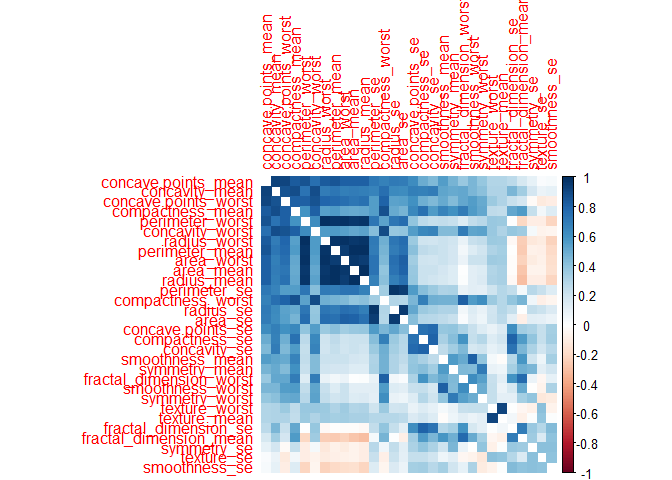
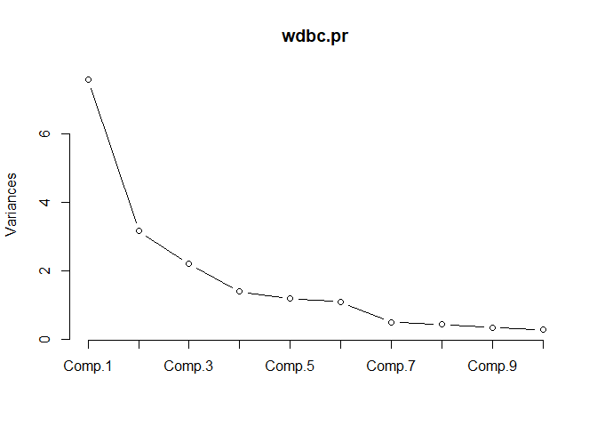

Exploratory Analysis of Final Project
================
Alvin Zhu

## Introduction

The analysis was performed using Wisconsin breast cancer data sets from
the UCI Machine Learning Database.  
The reasons of principal component analysis and other dimensionality
reduction techniques are described in detail. A linear discriminant
function is constructed to predict the new observed value. Discriminant
Analysis is a classification method that uses a “training sample” of a
known category to establish Discriminant criteria and to classify data
of an unknown category by using predictive variables. Linear
Discriminant Analysis (LDA) is one of the classical algorithms of
pattern recognition, introduced by Belhumeur to the field of pattern
recognition and artificial intelligence in 1996. LDA is based on Bayes
discriminant thought. Under the condition that there are only two kinds
of classification and the whole population obeys multivariate normal
distribution, Bayes discriminant is equivalent to Fisher discriminant
and distance discriminant.  
The basic idea is to project the high-dimensional model samples to the
best discriminant vector space, so as to extract the classification
information and compress the dimension of feature space. After
projection, the model samples are guaranteed to have the maximum
inter-class distance and the minimum inter-class distance in the new
subspace, that is, the model has the best separability in this space.

## Problem statement

Using this 32-variable dataset to measure the size and shape of the
nucleus, the goal is to create a model that allows us to predict whether
a breast cancer cell is benign or malignant.

## Data set discription

The features were calculated from digital images of a breast mass by
fine-needle aspiration (FNA). They describe the characteristics of the
nucleus in the image. Our dataset consists of 569 observations and 32
variables. There’s an ID variable, a diagnostic variable that says
whether they’re benign or malignant, and 30 measurement variables that
detail the size and shape of the nucleus. Diagnosis is a categorical
variable, which is our response variable, and these 30 measurement
variables are all continuous, which are the potential explanatory
variables of our model. \* radius \* texture \* perimeter \* area \*
smoothness \* compactness \* concavity \* concave points \* symmetry \*
fractal dimension

## Importing data

``` r
data <- read.csv("data.csv")
dim(data)
```

    ## [1] 569  33

``` r
head(data)
```

    ##         id diagnosis radius_mean texture_mean perimeter_mean area_mean
    ## 1   842302         M       17.99        10.38         122.80    1001.0
    ## 2   842517         M       20.57        17.77         132.90    1326.0
    ## 3 84300903         M       19.69        21.25         130.00    1203.0
    ## 4 84348301         M       11.42        20.38          77.58     386.1
    ## 5 84358402         M       20.29        14.34         135.10    1297.0
    ## 6   843786         M       12.45        15.70          82.57     477.1
    ##   smoothness_mean compactness_mean concavity_mean concave.points_mean
    ## 1         0.11840          0.27760         0.3001             0.14710
    ## 2         0.08474          0.07864         0.0869             0.07017
    ## 3         0.10960          0.15990         0.1974             0.12790
    ## 4         0.14250          0.28390         0.2414             0.10520
    ## 5         0.10030          0.13280         0.1980             0.10430
    ## 6         0.12780          0.17000         0.1578             0.08089
    ##   symmetry_mean fractal_dimension_mean radius_se texture_se perimeter_se
    ## 1        0.2419                0.07871    1.0950     0.9053        8.589
    ## 2        0.1812                0.05667    0.5435     0.7339        3.398
    ## 3        0.2069                0.05999    0.7456     0.7869        4.585
    ## 4        0.2597                0.09744    0.4956     1.1560        3.445
    ## 5        0.1809                0.05883    0.7572     0.7813        5.438
    ## 6        0.2087                0.07613    0.3345     0.8902        2.217
    ##   area_se smoothness_se compactness_se concavity_se concave.points_se
    ## 1  153.40      0.006399        0.04904      0.05373           0.01587
    ## 2   74.08      0.005225        0.01308      0.01860           0.01340
    ## 3   94.03      0.006150        0.04006      0.03832           0.02058
    ## 4   27.23      0.009110        0.07458      0.05661           0.01867
    ## 5   94.44      0.011490        0.02461      0.05688           0.01885
    ## 6   27.19      0.007510        0.03345      0.03672           0.01137
    ##   symmetry_se fractal_dimension_se radius_worst texture_worst perimeter_worst
    ## 1     0.03003             0.006193        25.38         17.33          184.60
    ## 2     0.01389             0.003532        24.99         23.41          158.80
    ## 3     0.02250             0.004571        23.57         25.53          152.50
    ## 4     0.05963             0.009208        14.91         26.50           98.87
    ## 5     0.01756             0.005115        22.54         16.67          152.20
    ## 6     0.02165             0.005082        15.47         23.75          103.40
    ##   area_worst smoothness_worst compactness_worst concavity_worst
    ## 1     2019.0           0.1622            0.6656          0.7119
    ## 2     1956.0           0.1238            0.1866          0.2416
    ## 3     1709.0           0.1444            0.4245          0.4504
    ## 4      567.7           0.2098            0.8663          0.6869
    ## 5     1575.0           0.1374            0.2050          0.4000
    ## 6      741.6           0.1791            0.5249          0.5355
    ##   concave.points_worst symmetry_worst fractal_dimension_worst  X
    ## 1               0.2654         0.4601                 0.11890 NA
    ## 2               0.1860         0.2750                 0.08902 NA
    ## 3               0.2430         0.3613                 0.08758 NA
    ## 4               0.2575         0.6638                 0.17300 NA
    ## 5               0.1625         0.2364                 0.07678 NA
    ## 6               0.1741         0.3985                 0.12440 NA

## Exploratory data analysis

``` r
wdbc.data <- as.matrix(data[, c(3:32)])
row.names(wdbc.data) <- data$id
diagnosis <- as.numeric(data$diagnosis == "M")
table(data$diagnosis)
```

    ## 
    ##   B   M 
    ## 357 212

``` r
library(corrplot)
```

    ## corrplot 0.84 loaded

``` r
cor.matrix <- data[, c(3:32)]
correlation <- round(cor(cor.matrix), 2)
cor(cor.matrix)
```

    ##                          radius_mean texture_mean perimeter_mean    area_mean
    ## radius_mean              1.000000000  0.323781891    0.997855281  0.987357170
    ## texture_mean             0.323781891  1.000000000    0.329533059  0.321085696
    ## perimeter_mean           0.997855281  0.329533059    1.000000000  0.986506804
    ## area_mean                0.987357170  0.321085696    0.986506804  1.000000000
    ## smoothness_mean          0.170581187 -0.023388516    0.207278164  0.177028377
    ## compactness_mean         0.506123578  0.236702222    0.556936211  0.498501682
    ## concavity_mean           0.676763550  0.302417828    0.716135650  0.685982829
    ## concave.points_mean      0.822528522  0.293464051    0.850977041  0.823268869
    ## symmetry_mean            0.147741242  0.071400980    0.183027212  0.151293079
    ## fractal_dimension_mean  -0.311630826 -0.076437183   -0.261476908 -0.283109812
    ## radius_se                0.679090388  0.275868676    0.691765014  0.732562227
    ## texture_se              -0.097317443  0.386357623   -0.086761078 -0.066280214
    ## perimeter_se             0.674171616  0.281673115    0.693134890  0.726628328
    ## area_se                  0.735863663  0.259844987    0.744982694  0.800085921
    ## smoothness_se           -0.222600125  0.006613777   -0.202694026 -0.166776667
    ## compactness_se           0.205999980  0.191974611    0.250743681  0.212582551
    ## concavity_se             0.194203623  0.143293077    0.228082345  0.207660060
    ## concave.points_se        0.376168956  0.163851025    0.407216916  0.372320282
    ## symmetry_se             -0.104320881  0.009127168   -0.081629327 -0.072496588
    ## fractal_dimension_se    -0.042641269  0.054457520   -0.005523391 -0.019886963
    ## radius_worst             0.969538973  0.352572947    0.969476363  0.962746086
    ## texture_worst            0.297007644  0.912044589    0.303038372  0.287488627
    ## perimeter_worst          0.965136514  0.358039575    0.970386887  0.959119574
    ## area_worst               0.941082460  0.343545947    0.941549808  0.959213326
    ## smoothness_worst         0.119616140  0.077503359    0.150549404  0.123522939
    ## compactness_worst        0.413462823  0.277829592    0.455774228  0.390410309
    ## concavity_worst          0.526911462  0.301025224    0.563879263  0.512605920
    ## concave.points_worst     0.744214198  0.295315843    0.771240789  0.722016626
    ## symmetry_worst           0.163953335  0.105007910    0.189115040  0.143569914
    ## fractal_dimension_worst  0.007065886  0.119205351    0.051018530  0.003737597
    ##                         smoothness_mean compactness_mean concavity_mean
    ## radius_mean                  0.17058119       0.50612358     0.67676355
    ## texture_mean                -0.02338852       0.23670222     0.30241783
    ## perimeter_mean               0.20727816       0.55693621     0.71613565
    ## area_mean                    0.17702838       0.49850168     0.68598283
    ## smoothness_mean              1.00000000       0.65912322     0.52198377
    ## compactness_mean             0.65912322       1.00000000     0.88312067
    ## concavity_mean               0.52198377       0.88312067     1.00000000
    ## concave.points_mean          0.55369517       0.83113504     0.92139103
    ## symmetry_mean                0.55777479       0.60264105     0.50066662
    ## fractal_dimension_mean       0.58479200       0.56536866     0.33678336
    ## radius_se                    0.30146710       0.49747345     0.63192482
    ## texture_se                   0.06840645       0.04620483     0.07621835
    ## perimeter_se                 0.29609193       0.54890526     0.66039079
    ## area_se                      0.24655243       0.45565285     0.61742681
    ## smoothness_se                0.33237544       0.13529927     0.09856375
    ## compactness_se               0.31894330       0.73872179     0.67027882
    ## concavity_se                 0.24839568       0.57051687     0.69127021
    ## concave.points_se            0.38067569       0.64226185     0.68325992
    ## symmetry_se                  0.20077438       0.22997659     0.17800921
    ## fractal_dimension_se         0.28360670       0.50731813     0.44930075
    ## radius_worst                 0.21312014       0.53531540     0.68823641
    ## texture_worst                0.03607180       0.24813283     0.29987889
    ## perimeter_worst              0.23885263       0.59021043     0.72956492
    ## area_worst                   0.20671836       0.50960381     0.67598723
    ## smoothness_worst             0.80532420       0.56554117     0.44882204
    ## compactness_worst            0.47246844       0.86580904     0.75496802
    ## concavity_worst              0.43492571       0.81627525     0.88410264
    ## concave.points_worst         0.50305335       0.81557322     0.86132303
    ## symmetry_worst               0.39430948       0.51022343     0.40946413
    ## fractal_dimension_worst      0.49931637       0.68738232     0.51492989
    ##                         concave.points_mean symmetry_mean
    ## radius_mean                      0.82252852    0.14774124
    ## texture_mean                     0.29346405    0.07140098
    ## perimeter_mean                   0.85097704    0.18302721
    ## area_mean                        0.82326887    0.15129308
    ## smoothness_mean                  0.55369517    0.55777479
    ## compactness_mean                 0.83113504    0.60264105
    ## concavity_mean                   0.92139103    0.50066662
    ## concave.points_mean              1.00000000    0.46249739
    ## symmetry_mean                    0.46249739    1.00000000
    ## fractal_dimension_mean           0.16691738    0.47992133
    ## radius_se                        0.69804983    0.30337926
    ## texture_se                       0.02147958    0.12805293
    ## perimeter_se                     0.71064987    0.31389276
    ## area_se                          0.69029854    0.22397022
    ## smoothness_se                    0.02765331    0.18732117
    ## compactness_se                   0.49042425    0.42165915
    ## concavity_se                     0.43916707    0.34262702
    ## concave.points_se                0.61563413    0.39329787
    ## symmetry_se                      0.09535079    0.44913654
    ## fractal_dimension_se             0.25758375    0.33178615
    ## radius_worst                     0.83031763    0.18572775
    ## texture_worst                    0.29275171    0.09065069
    ## perimeter_worst                  0.85592313    0.21916856
    ## area_worst                       0.80962962    0.17719338
    ## smoothness_worst                 0.45275305    0.42667503
    ## compactness_worst                0.66745368    0.47320001
    ## concavity_worst                  0.75239950    0.43372101
    ## concave.points_worst             0.91015531    0.43029661
    ## symmetry_worst                   0.37574415    0.69982580
    ## fractal_dimension_worst          0.36866113    0.43841350
    ##                         fractal_dimension_mean    radius_se  texture_se
    ## radius_mean                      -0.3116308263 0.6790903880 -0.09731744
    ## texture_mean                     -0.0764371834 0.2758686762  0.38635762
    ## perimeter_mean                   -0.2614769081 0.6917650135 -0.08676108
    ## area_mean                        -0.2831098117 0.7325622270 -0.06628021
    ## smoothness_mean                   0.5847920019 0.3014670983  0.06840645
    ## compactness_mean                  0.5653686634 0.4974734461  0.04620483
    ## concavity_mean                    0.3367833594 0.6319248221  0.07621835
    ## concave.points_mean               0.1669173832 0.6980498336  0.02147958
    ## symmetry_mean                     0.4799213301 0.3033792632  0.12805293
    ## fractal_dimension_mean            1.0000000000 0.0001109951  0.16417397
    ## radius_se                         0.0001109951 1.0000000000  0.21324734
    ## texture_se                        0.1641739659 0.2132473373  1.00000000
    ## perimeter_se                      0.0398299316 0.9727936770  0.22317073
    ## area_se                          -0.0901702475 0.9518301121  0.11156725
    ## smoothness_se                     0.4019644254 0.1645142198  0.39724285
    ## compactness_se                    0.5598366906 0.3560645755  0.23169970
    ## concavity_se                      0.4466303217 0.3323575376  0.19499846
    ## concave.points_se                 0.3411980444 0.5133464414  0.23028340
    ## symmetry_se                       0.3450073971 0.2405673625  0.41162068
    ## fractal_dimension_se              0.6881315775 0.2277535327  0.27972275
    ## radius_worst                     -0.2536914949 0.7150651951 -0.11169031
    ## texture_worst                    -0.0512692020 0.1947985568  0.40900277
    ## perimeter_worst                  -0.2051512113 0.7196838037 -0.10224192
    ## area_worst                       -0.2318544512 0.7515484761 -0.08319499
    ## smoothness_worst                  0.5049420754 0.1419185529 -0.07365766
    ## compactness_worst                 0.4587981567 0.2871031656 -0.09243935
    ## concavity_worst                   0.3462338763 0.3805846346 -0.06895622
    ## concave.points_worst              0.1753254492 0.5310623278 -0.11963752
    ## symmetry_worst                    0.3340186839 0.0945428304 -0.12821476
    ## fractal_dimension_worst           0.7672967792 0.0495594325 -0.04565457
    ##                         perimeter_se     area_se smoothness_se compactness_se
    ## radius_mean               0.67417162  0.73586366  -0.222600125      0.2060000
    ## texture_mean              0.28167311  0.25984499   0.006613777      0.1919746
    ## perimeter_mean            0.69313489  0.74498269  -0.202694026      0.2507437
    ## area_mean                 0.72662833  0.80008592  -0.166776667      0.2125826
    ## smoothness_mean           0.29609193  0.24655243   0.332375443      0.3189433
    ## compactness_mean          0.54890526  0.45565285   0.135299268      0.7387218
    ## concavity_mean            0.66039079  0.61742681   0.098563746      0.6702788
    ## concave.points_mean       0.71064987  0.69029854   0.027653308      0.4904242
    ## symmetry_mean             0.31389276  0.22397022   0.187321165      0.4216591
    ## fractal_dimension_mean    0.03982993 -0.09017025   0.401964425      0.5598367
    ## radius_se                 0.97279368  0.95183011   0.164514220      0.3560646
    ## texture_se                0.22317073  0.11156725   0.397242853      0.2316997
    ## perimeter_se              1.00000000  0.93765541   0.151075331      0.4163224
    ## area_se                   0.93765541  1.00000000   0.075150338      0.2848401
    ## smoothness_se             0.15107533  0.07515034   1.000000000      0.3366961
    ## compactness_se            0.41632237  0.28484006   0.336696081      1.0000000
    ## concavity_se              0.36248158  0.27089473   0.268684760      0.8012683
    ## concave.points_se         0.55626408  0.41572957   0.328429499      0.7440827
    ## symmetry_se               0.26648709  0.13410898   0.413506125      0.3947128
    ## fractal_dimension_se      0.24414277  0.12707090   0.427374207      0.8032688
    ## radius_worst              0.69720059  0.75737319  -0.230690710      0.2046072
    ## texture_worst             0.20037085  0.19649665  -0.074742965      0.1430026
    ## perimeter_worst           0.72103131  0.76121264  -0.217303755      0.2605158
    ## area_worst                0.73071297  0.81140796  -0.182195478      0.1993713
    ## smoothness_worst          0.13005439  0.12538943   0.314457456      0.2273942
    ## compactness_worst         0.34191945  0.28325654  -0.055558139      0.6787804
    ## concavity_worst           0.41889882  0.38510014  -0.058298387      0.6391467
    ## concave.points_worst      0.55489723  0.53816631  -0.102006796      0.4832083
    ## symmetry_worst            0.10993043  0.07412629  -0.107342098      0.2778784
    ## fractal_dimension_worst   0.08543257  0.01753930   0.101480315      0.5909728
    ##                         concavity_se concave.points_se  symmetry_se
    ## radius_mean                0.1942036        0.37616896 -0.104320881
    ## texture_mean               0.1432931        0.16385103  0.009127168
    ## perimeter_mean             0.2280823        0.40721692 -0.081629327
    ## area_mean                  0.2076601        0.37232028 -0.072496588
    ## smoothness_mean            0.2483957        0.38067569  0.200774376
    ## compactness_mean           0.5705169        0.64226185  0.229976591
    ## concavity_mean             0.6912702        0.68325992  0.178009208
    ## concave.points_mean        0.4391671        0.61563413  0.095350787
    ## symmetry_mean              0.3426270        0.39329787  0.449136542
    ## fractal_dimension_mean     0.4466303        0.34119804  0.345007397
    ## radius_se                  0.3323575        0.51334644  0.240567362
    ## texture_se                 0.1949985        0.23028340  0.411620680
    ## perimeter_se               0.3624816        0.55626408  0.266487092
    ## area_se                    0.2708947        0.41572957  0.134108980
    ## smoothness_se              0.2686848        0.32842950  0.413506125
    ## compactness_se             0.8012683        0.74408267  0.394712835
    ## concavity_se               1.0000000        0.77180399  0.309428578
    ## concave.points_se          0.7718040        1.00000000  0.312780223
    ## symmetry_se                0.3094286        0.31278022  1.000000000
    ## fractal_dimension_se       0.7273722        0.61104414  0.369078083
    ## radius_worst               0.1869035        0.35812667 -0.128120769
    ## texture_worst              0.1002410        0.08674121 -0.077473420
    ## perimeter_worst            0.2266804        0.39499925 -0.103753044
    ## area_worst                 0.1883527        0.34227116 -0.110342743
    ## smoothness_worst           0.1684813        0.21535060 -0.012661800
    ## compactness_worst          0.4848578        0.45288838  0.060254879
    ## concavity_worst            0.6625641        0.54959238  0.037119049
    ## concave.points_worst       0.4404723        0.60244961 -0.030413396
    ## symmetry_worst             0.1977878        0.14311567  0.389402485
    ## fractal_dimension_worst    0.4393293        0.31065455  0.078079476
    ##                         fractal_dimension_se radius_worst texture_worst
    ## radius_mean                     -0.042641269   0.96953897   0.297007644
    ## texture_mean                     0.054457520   0.35257295   0.912044589
    ## perimeter_mean                  -0.005523391   0.96947636   0.303038372
    ## area_mean                       -0.019886963   0.96274609   0.287488627
    ## smoothness_mean                  0.283606699   0.21312014   0.036071799
    ## compactness_mean                 0.507318127   0.53531540   0.248132833
    ## concavity_mean                   0.449300749   0.68823641   0.299878889
    ## concave.points_mean              0.257583746   0.83031763   0.292751713
    ## symmetry_mean                    0.331786146   0.18572775   0.090650688
    ## fractal_dimension_mean           0.688131577  -0.25369149  -0.051269202
    ## radius_se                        0.227753533   0.71506520   0.194798557
    ## texture_se                       0.279722748  -0.11169031   0.409002766
    ## perimeter_se                     0.244142773   0.69720059   0.200370854
    ## area_se                          0.127070903   0.75737319   0.196496649
    ## smoothness_se                    0.427374207  -0.23069071  -0.074742965
    ## compactness_se                   0.803268818   0.20460717   0.143002583
    ## concavity_se                     0.727372184   0.18690352   0.100240984
    ## concave.points_se                0.611044139   0.35812667   0.086741210
    ## symmetry_se                      0.369078083  -0.12812077  -0.077473420
    ## fractal_dimension_se             1.000000000  -0.03748762  -0.003195029
    ## radius_worst                    -0.037487618   1.00000000   0.359920754
    ## texture_worst                   -0.003195029   0.35992075   1.000000000
    ## perimeter_worst                 -0.001000398   0.99370792   0.365098245
    ## area_worst                      -0.022736147   0.98401456   0.345842283
    ## smoothness_worst                 0.170568316   0.21657443   0.225429415
    ## compactness_worst                0.390158842   0.47582004   0.360832339
    ## concavity_worst                  0.379974661   0.57397471   0.368365607
    ## concave.points_worst             0.215204013   0.78742385   0.359754610
    ## symmetry_worst                   0.111093956   0.24352920   0.233027461
    ## fractal_dimension_worst          0.591328066   0.09349198   0.219122425
    ##                         perimeter_worst  area_worst smoothness_worst
    ## radius_mean                 0.965136514  0.94108246       0.11961614
    ## texture_mean                0.358039575  0.34354595       0.07750336
    ## perimeter_mean              0.970386887  0.94154981       0.15054940
    ## area_mean                   0.959119574  0.95921333       0.12352294
    ## smoothness_mean             0.238852626  0.20671836       0.80532420
    ## compactness_mean            0.590210428  0.50960381       0.56554117
    ## concavity_mean              0.729564917  0.67598723       0.44882204
    ## concave.points_mean         0.855923128  0.80962962       0.45275305
    ## symmetry_mean               0.219168559  0.17719338       0.42667503
    ## fractal_dimension_mean     -0.205151211 -0.23185445       0.50494208
    ## radius_se                   0.719683804  0.75154848       0.14191855
    ## texture_se                 -0.102241922 -0.08319499      -0.07365766
    ## perimeter_se                0.721031310  0.73071297       0.13005439
    ## area_se                     0.761212636  0.81140796       0.12538943
    ## smoothness_se              -0.217303755 -0.18219548       0.31445746
    ## compactness_se              0.260515840  0.19937133       0.22739423
    ## concavity_se                0.226680426  0.18835265       0.16848132
    ## concave.points_se           0.394999252  0.34227116       0.21535060
    ## symmetry_se                -0.103753044 -0.11034274      -0.01266180
    ## fractal_dimension_se       -0.001000398 -0.02273615       0.17056832
    ## radius_worst                0.993707916  0.98401456       0.21657443
    ## texture_worst               0.365098245  0.34584228       0.22542941
    ## perimeter_worst             1.000000000  0.97757809       0.23677460
    ## area_worst                  0.977578091  1.00000000       0.20914533
    ## smoothness_worst            0.236774604  0.20914533       1.00000000
    ## compactness_worst           0.529407690  0.43829628       0.56818652
    ## concavity_worst             0.618344080  0.54333053       0.51852329
    ## concave.points_worst        0.816322102  0.74741880       0.54769090
    ## symmetry_worst              0.269492769  0.20914551       0.49383833
    ## fractal_dimension_worst     0.138956862  0.07964703       0.61762419
    ##                         compactness_worst concavity_worst concave.points_worst
    ## radius_mean                    0.41346282      0.52691146            0.7442142
    ## texture_mean                   0.27782959      0.30102522            0.2953158
    ## perimeter_mean                 0.45577423      0.56387926            0.7712408
    ## area_mean                      0.39041031      0.51260592            0.7220166
    ## smoothness_mean                0.47246844      0.43492571            0.5030534
    ## compactness_mean               0.86580904      0.81627525            0.8155732
    ## concavity_mean                 0.75496802      0.88410264            0.8613230
    ## concave.points_mean            0.66745368      0.75239950            0.9101553
    ## symmetry_mean                  0.47320001      0.43372101            0.4302966
    ## fractal_dimension_mean         0.45879816      0.34623388            0.1753254
    ## radius_se                      0.28710317      0.38058463            0.5310623
    ## texture_se                    -0.09243935     -0.06895622           -0.1196375
    ## perimeter_se                   0.34191945      0.41889882            0.5548972
    ## area_se                        0.28325654      0.38510014            0.5381663
    ## smoothness_se                 -0.05555814     -0.05829839           -0.1020068
    ## compactness_se                 0.67878035      0.63914670            0.4832083
    ## concavity_se                   0.48485780      0.66256413            0.4404723
    ## concave.points_se              0.45288838      0.54959238            0.6024496
    ## symmetry_se                    0.06025488      0.03711905           -0.0304134
    ## fractal_dimension_se           0.39015884      0.37997466            0.2152040
    ## radius_worst                   0.47582004      0.57397471            0.7874239
    ## texture_worst                  0.36083234      0.36836561            0.3597546
    ## perimeter_worst                0.52940769      0.61834408            0.8163221
    ## area_worst                     0.43829628      0.54333053            0.7474188
    ## smoothness_worst               0.56818652      0.51852329            0.5476909
    ## compactness_worst              1.00000000      0.89226090            0.8010804
    ## concavity_worst                0.89226090      1.00000000            0.8554339
    ## concave.points_worst           0.80108036      0.85543386            1.0000000
    ## symmetry_worst                 0.61444050      0.53251973            0.5025285
    ## fractal_dimension_worst        0.81045486      0.68651092            0.5111141
    ##                         symmetry_worst fractal_dimension_worst
    ## radius_mean                 0.16395333             0.007065886
    ## texture_mean                0.10500791             0.119205351
    ## perimeter_mean              0.18911504             0.051018530
    ## area_mean                   0.14356991             0.003737597
    ## smoothness_mean             0.39430948             0.499316369
    ## compactness_mean            0.51022343             0.687382323
    ## concavity_mean              0.40946413             0.514929891
    ## concave.points_mean         0.37574415             0.368661134
    ## symmetry_mean               0.69982580             0.438413498
    ## fractal_dimension_mean      0.33401868             0.767296779
    ## radius_se                   0.09454283             0.049559432
    ## texture_se                 -0.12821476            -0.045654569
    ## perimeter_se                0.10993043             0.085432572
    ## area_se                     0.07412629             0.017539295
    ## smoothness_se              -0.10734210             0.101480315
    ## compactness_se              0.27787843             0.590972763
    ## concavity_se                0.19778782             0.439329269
    ## concave.points_se           0.14311567             0.310654551
    ## symmetry_se                 0.38940248             0.078079476
    ## fractal_dimension_se        0.11109396             0.591328066
    ## radius_worst                0.24352920             0.093491979
    ## texture_worst               0.23302746             0.219122425
    ## perimeter_worst             0.26949277             0.138956862
    ## area_worst                  0.20914551             0.079647034
    ## smoothness_worst            0.49383833             0.617624192
    ## compactness_worst           0.61444050             0.810454856
    ## concavity_worst             0.53251973             0.686510921
    ## concave.points_worst        0.50252849             0.511114146
    ## symmetry_worst              1.00000000             0.537848206
    ## fractal_dimension_worst     0.53784821             1.000000000

``` r
corrplot(correlation, diag = FALSE, method = "color", order = "FPC", tl.srt = 90)
```

<!-- -->

As you can see from corrplot, there are many variables that are highly
correlated with each other.

``` r
drop.list = c('perimeter_mean', 'area_mean', 'compactness_mean', 'concave points_mean', 'radius_se', 'perimeter_se', 'radius_worst',
              'perimeter_worst', 'compactness_worst', 'concave points_worst', 'compactness_se', 'concave points_se', 'texture_worst', 
              'area_worst')
wdbc.data <- as.data.frame(wdbc.data)
droped.data <- wdbc.data[, !names(wdbc.data) %in% drop.list]
```

## Principal Components Analysis

Because of the large number of variables in the model, we can try to use
dimensionality reduction techniques to uncover any pattern in the data.
As mentioned in the exploratory data analysis section, there are 30
variables that, when combined, can be used to model the diagnosis of
each patient. Using principal component analysis, we can combine many of
our variables into different linear combinations, each of which explains
part of the variance of the model. By using PCA, we assume a linear
combination of variables in the dataset. We can reduce the complexity of
the model by selecting only linear combinations that provide the
majority (\>= 85%) of the covariances. Then we can more easily see how
the model works and provide meaningful graphs and representations of
complex data sets.

### Running PCA using correlation matrix

``` r
wdbc.pr <- princomp(droped.data, cor = TRUE)
screeplot(wdbc.pr, type = "lines")
```

<!-- -->

``` r
summary(wdbc.pr)
```

    ## Importance of components:
    ##                           Comp.1    Comp.2    Comp.3     Comp.4     Comp.5
    ## Standard deviation     2.7521211 1.7766675 1.4838651 1.18056044 1.09026803
    ## Proportion of Variance 0.3986406 0.1661341 0.1158871 0.07335384 0.06256234
    ## Cumulative Proportion  0.3986406 0.5647746 0.6806618 0.75401561 0.81657795
    ##                            Comp.6     Comp.7     Comp.8     Comp.9    Comp.10
    ## Standard deviation     1.04324867 0.70074868 0.66631378 0.58777974 0.52518408
    ## Proportion of Variance 0.05728251 0.02584467 0.02336706 0.01818342 0.01451675
    ## Cumulative Proportion  0.87386046 0.89970513 0.92307219 0.94125561 0.95577236
    ##                           Comp.11    Comp.12     Comp.13     Comp.14
    ## Standard deviation     0.48762702 0.44416892 0.396073806 0.280682202
    ## Proportion of Variance 0.01251474 0.01038348 0.008256551 0.004146447
    ## Cumulative Proportion  0.96828711 0.97867058 0.986927132 0.991073579
    ##                            Comp.15     Comp.16     Comp.17    Comp.18
    ## Standard deviation     0.241758053 0.222792898 0.169116709 0.15633448
    ## Proportion of Variance 0.003076156 0.002612457 0.001505287 0.00128634
    ## Cumulative Proportion  0.994149735 0.996762192 0.998267479 0.99955382
    ##                             Comp.19
    ## Standard deviation     0.0920729609
    ## Proportion of Variance 0.0004461805
    ## Cumulative Proportion  1.0000000000

``` r
wdbc.pr$loadings
```

    ## 
    ## Loadings:
    ##                         Comp.1 Comp.2 Comp.3 Comp.4 Comp.5 Comp.6 Comp.7 Comp.8
    ## radius_mean              0.188  0.439  0.116                       0.106       
    ## texture_mean             0.101  0.143  0.215  0.142 -0.136 -0.745 -0.124  0.201
    ## smoothness_mean          0.248 -0.127 -0.203  0.238  0.390               -0.312
    ## concavity_mean           0.337  0.138                                          
    ## concave.points_mean      0.310  0.241                0.107                     
    ## symmetry_mean            0.239 -0.137 -0.112  0.341 -0.256  0.152        -0.275
    ## fractal_dimension_mean   0.199 -0.401 -0.131 -0.124                0.350       
    ## texture_se                     -0.189  0.431  0.277        -0.384  0.167 -0.475
    ## area_se                  0.190  0.270  0.252  0.182  0.156  0.174  0.478  0.330
    ## smoothness_se                  -0.332  0.243  0.174  0.435        -0.341  0.456
    ## concavity_se             0.252 -0.113  0.242 -0.361 -0.154        -0.286       
    ## concave.points_se        0.267         0.287 -0.172         0.190 -0.344 -0.269
    ## symmetry_se              0.108 -0.273  0.233  0.387 -0.346  0.260         0.256
    ## fractal_dimension_se     0.208 -0.296  0.207 -0.336                0.280  0.122
    ## smoothness_worst         0.227        -0.343  0.157  0.387 -0.170 -0.215       
    ## concavity_worst          0.314  0.121        -0.206 -0.131 -0.125 -0.149       
    ## concave.points_worst     0.309  0.246                             -0.123       
    ## symmetry_worst           0.205        -0.324  0.290 -0.463        -0.151  0.169
    ## fractal_dimension_worst  0.250 -0.184 -0.272 -0.244        -0.249  0.285  0.175
    ##                         Comp.9 Comp.10 Comp.11 Comp.12 Comp.13 Comp.14 Comp.15
    ## radius_mean                     0.138   0.256   0.199   0.282           0.381 
    ## texture_mean            -0.296  0.263  -0.330                                 
    ## smoothness_mean                 0.188  -0.406   0.105   0.277  -0.277   0.336 
    ## concavity_mean           0.118 -0.179           0.372  -0.120   0.143  -0.153 
    ## concave.points_mean             0.151   0.154   0.306           0.214  -0.132 
    ## symmetry_mean           -0.654 -0.280           0.124          -0.197  -0.164 
    ## fractal_dimension_mean          0.137  -0.170   0.126  -0.409   0.477   0.116 
    ## texture_se               0.321 -0.266   0.304  -0.154                         
    ## area_se                        -0.272  -0.264  -0.475  -0.100                 
    ## smoothness_se           -0.146 -0.155   0.310   0.175  -0.155           0.239 
    ## concavity_se                   -0.356  -0.367           0.224   0.176   0.171 
    ## concave.points_se       -0.160  0.392          -0.451  -0.232                 
    ## symmetry_se              0.411  0.313  -0.150   0.109          -0.229  -0.240 
    ## fractal_dimension_se    -0.199  0.181   0.213           0.581          -0.258 
    ## smoothness_worst         0.124                 -0.257   0.250   0.155  -0.459 
    ## concavity_worst          0.246 -0.309           0.103  -0.148  -0.398         
    ## concave.points_worst            0.194   0.243  -0.153  -0.165          -0.215 
    ## symmetry_worst                          0.138  -0.245   0.192   0.377   0.356 
    ## fractal_dimension_worst                 0.242  -0.148  -0.147  -0.416   0.231 
    ##                         Comp.16 Comp.17 Comp.18 Comp.19
    ## radius_mean              0.588   0.114   0.122         
    ## texture_mean                                           
    ## smoothness_mean         -0.249                         
    ## concavity_mean          -0.198  -0.308   0.275   0.631 
    ## concave.points_mean     -0.238  -0.338  -0.120  -0.637 
    ## symmetry_mean            0.179                         
    ## fractal_dimension_mean   0.261   0.294                 
    ## texture_se                                             
    ## area_se                 -0.103                         
    ## smoothness_se           -0.120                         
    ## concavity_se             0.199  -0.132  -0.417  -0.103 
    ## concave.points_se               -0.143   0.342         
    ## symmetry_se              0.190                         
    ## fractal_dimension_se    -0.219   0.185   0.110         
    ## smoothness_worst         0.361  -0.146   0.147         
    ## concavity_worst                  0.452   0.361  -0.298 
    ## concave.points_worst    -0.100   0.411  -0.594   0.281 
    ## symmetry_worst          -0.300           0.143         
    ## fractal_dimension_worst  0.105  -0.455  -0.196         
    ## 
    ##                Comp.1 Comp.2 Comp.3 Comp.4 Comp.5 Comp.6 Comp.7 Comp.8 Comp.9
    ## SS loadings     1.000  1.000  1.000  1.000  1.000  1.000  1.000  1.000  1.000
    ## Proportion Var  0.053  0.053  0.053  0.053  0.053  0.053  0.053  0.053  0.053
    ## Cumulative Var  0.053  0.105  0.158  0.211  0.263  0.316  0.368  0.421  0.474
    ##                Comp.10 Comp.11 Comp.12 Comp.13 Comp.14 Comp.15 Comp.16 Comp.17
    ## SS loadings      1.000   1.000   1.000   1.000   1.000   1.000   1.000   1.000
    ## Proportion Var   0.053   0.053   0.053   0.053   0.053   0.053   0.053   0.053
    ## Cumulative Var   0.526   0.579   0.632   0.684   0.737   0.789   0.842   0.895
    ##                Comp.18 Comp.19
    ## SS loadings      1.000   1.000
    ## Proportion Var   0.053   0.053
    ## Cumulative Var   0.947   1.000

``` r
wdbc.pr$scores[, 1:6]  # principal component score
```

    ##                 Comp.1       Comp.2       Comp.3        Comp.4      Comp.5
    ## 842302     6.868231415  0.148384790 -2.009965571  0.6864257691 -0.63458883
    ## 842517     0.219743033  2.434819417 -0.097645778 -0.5416293129  0.01937682
    ## 84300903   3.781388662  2.144744056 -0.185586652  0.5819066267 -0.11743821
    ## 84348301   9.441125655 -5.469301000 -4.231102036  2.3973930820 -2.77510050
    ## 84358402   2.161054560  1.469237887  1.191091477 -0.7043178104  1.75808359
    ## 843786     3.678712363 -1.701873389 -3.177404904  0.1352246774  0.47394709
    ## 844359     0.627863739  2.349538144 -1.023933700 -0.0942222790  0.07076502
    ## 84458202   2.447663192 -1.473219455 -1.438014621  0.4029063540  1.10199343
    ## 844981     4.057862660 -0.698067520 -2.885410842  1.1336089437 -0.54122618
    ## 84501001   7.435738340 -2.739430839 -3.272016737 -2.5268552107 -0.99508505
    ## 845636    -1.791704760  1.421015213  0.025044041 -0.2595829007 -0.61011553
    ## 84610002   1.415127473  0.683016796 -1.195047796 -0.0550664609 -0.70022077
    ## 846226     6.012757672 -1.669280719  5.113597181  0.1036657729 -2.76293717
    ## 846381    -0.139244703  0.706294804  2.141487946  0.5009109765 -0.74132543
    ## 84667401   4.865553698 -1.347944886 -1.901025524 -1.4463667316 -0.44737847
    ## 84799002   4.205973382 -0.527479915 -2.485244576  0.0905908210 -1.22444711
    ## 848406    -0.200571487  1.148971870 -0.657951546  0.0512126595  0.57571172
    ## 84862001   3.873287914 -0.071860823 -2.235505961  0.4926663526  0.60158581
    ## 849014     1.796007201  3.389237011  0.301831118 -0.0590156202  1.13481147
    ## 8510426   -0.505193685  0.162847358 -0.744358154  0.3557416191  0.54657055
    ## 8510653   -0.991410038 -0.418475108 -1.924873059  0.2240508039 -0.21649605
    ## 8510824   -1.472811221 -1.917728049 -0.468590196 -0.1521440367  1.14502653
    ## 8511133    4.827468748 -0.568628071 -1.366849442  0.7736857903 -2.28438122
    ## 851509     0.595737383  3.483819294  0.062420191  0.4886502078  0.56387613
    ## 852552     2.864353447  1.521604812 -1.805041307  0.8525992565  0.83936531
    ## 852631     6.118548810 -0.361096019 -1.129331303  1.4247443479 -0.44185588
    ## 852763     3.529735951  0.396652619 -2.876749823 -0.0732226025 -1.22241652
    ## 852781     1.327125651  1.033027143  2.484569711  0.2193922446  1.12332546
    ## 852973     2.918868827  1.063255689 -1.846410978  0.4272807010 -0.54275023
    ## 853201     0.325129366  1.221693390 -0.064799366 -0.4153385968  0.33272828
    ## 853401     3.931665396  1.701921212  0.057275134  0.7539861665 -0.36520800
    ## 853612     3.824060555 -1.978140761 -3.348784232 -0.0113260986 -1.70216686
    ## 85382601   3.899347465  0.869127255 -0.497306149  1.4070085730  0.36946188
    ## 854002     2.501881097  1.969196487 -1.408436940 -0.4544103552 -0.78794805
    ## 854039     2.357814078  0.654142683 -2.819395152 -0.2448759486 -1.19828893
    ## 854253     2.032346308  1.157573611 -1.445679901  1.2965358516 -1.84596537
    ## 854268     1.492104660  0.259770582 -1.023361412 -0.3365969526 -0.91446519
    ## 854941    -2.978299428 -0.022910489  2.073652691  0.4587203857 -0.22711188
    ## 855133    -2.506975120  1.462610105  3.302479159  0.1748438904  1.36784803
    ## 855138     1.316111392  0.721857141 -1.944211595 -1.2109189191  0.53143482
    ## 855167    -2.287663418  1.445768233 -0.602538215 -0.1273232394 -1.18049372
    ## 855563     1.495328058 -1.029633768 -1.952008733  0.5264264601  1.82867450
    ## 855625     5.977471266  0.017809843  2.057636069  1.1010106341 -3.91927146
    ## 856106     1.202352990 -0.047130593 -2.186094265  0.1861907252 -0.44488600
    ## 85638502   0.011788545  1.138390124 -2.569102817 -0.2214000230 -0.53002439
    ## 857010     3.889739832  1.675147309 -1.291395506  0.0596775516 -0.08632226
    ## 85713702  -2.522551675 -1.839996778 -0.578519595  0.5680623659 -0.37975160
    ## 85715      2.914942513 -0.458917983 -2.970231756  0.3072290169  0.14913893
    ## 857155    -1.328669028 -0.016129804 -1.709669964 -0.4436853412  0.73237810
    ## 857156    -1.388329387  1.001744042  0.227393897  0.1556768336 -0.76414129
    ## 857343    -3.136976147  0.063094298  0.776693372  0.3056533282 -0.32036679
    ## 857373    -3.080573384  0.787894070 -0.147468630 -1.3684989669 -0.05028632
    ## 857374    -2.385987553 -0.287825195 -0.387984765  0.0116664614 -0.55097407
    ## 857392     1.854963842  1.026969397  0.401817968  1.3214964436 -0.19351414
    ## 857438    -1.187626028  1.690378945 -0.802985674 -0.4200210989  0.30551068
    ## 85759902  -1.585062355 -0.890384605 -0.157575064  1.5463522695 -0.77721112
    ## 857637     2.299888314  1.889794809 -0.581384195  1.0092387746  0.58535927
    ## 857793     2.140836342  0.317910811 -1.603890745  0.2005537742 -0.68754180
    ## 857810    -3.576370916 -0.050818978  0.855614584  0.7738477770 -0.46027675
    ## 858477    -1.426074729 -2.508609958 -2.377263533  0.0377424588  1.14213537
    ## 858970    -0.207329079 -3.468104801 -0.597280676  2.9452846362 -1.56269834
    ## 858981    -0.520793217 -3.294129296  0.221275950  2.3123133430  1.26413911
    ## 858986     3.986594314 -0.574327740 -0.200558826 -1.2998098136  0.76921835
    ## 859196    -0.354190972 -3.354514512  1.787535004  1.0576030112 -2.51923546
    ## 85922302   2.114784496 -0.308221720 -1.670242152  0.4709836737  0.94366867
    ## 859283     1.870614245  0.202772275 -1.122762534  1.0733332199  0.70884098
    ## 859464    -0.816971251 -2.555598567 -0.032132765  0.8845170985  0.99024330
    ## 859465    -2.512702957 -0.086142099  0.499211250 -0.0734432653  0.44172191
    ## 859471     8.267419740 -4.183236375  1.657570947 -4.4044440466 -3.34409808
    ## 859487    -2.334313471  0.020626881  0.012100530  0.3606525201  0.81924593
    ## 859575    -0.230906817  3.268990887  0.640109098 -0.2033508200  0.38968423
    ## 859711     1.950489292 -6.420523103  1.798820793 -3.3867960933  1.20172000
    ## 859717     3.512216587  0.702083128 -1.386022692 -0.9244233736 -0.09610187
    ## 859983    -0.315505333  0.368214269 -1.812791934 -1.1999303546  0.72024894
    ## 8610175   -2.153817907  0.355872210 -0.565165156 -0.4348050238 -0.05799142
    ## 8610404    0.290941380  1.441555928  0.852790733  0.4442557925  1.40132584
    ## 8610629    0.502451762 -2.278038167 -0.666719556  1.8761612075  1.91388210
    ## 8610637    4.154811624  0.478622764 -0.501867802  0.0484664003 -0.08562876
    ## 8610862   10.016616814 -2.138800174  1.413050807  4.4444878397 -3.52846783
    ## 8610908   -1.588738973 -0.002022522 -0.615571494 -0.0240955519  0.06985058
    ## 861103    -0.319499658 -2.142709862 -0.016648311  0.9538243766  1.31114331
    ## 8611161    1.996745958 -0.752351861 -1.661351573 -0.3471523603 -0.11422211
    ## 8611555    5.918270315  3.249886286  1.170747815 -1.0119248495  1.91171025
    ## 8611792    3.591682291 -0.398595180  2.789442958  0.6935761270  1.32291162
    ## 8612080   -1.120627850 -0.604806987 -1.201947504  0.8548667594 -0.62151733
    ## 8612399    1.910488010  1.025530546 -0.030003704  1.3093547791 -0.59819770
    ## 86135501   0.739709438 -0.132754935  1.817812088  1.0970341699 -0.38444357
    ## 86135502   1.917987207  2.502787956 -0.768861931  0.0195220350 -1.86587954
    ## 861597    -0.162454596 -0.640789288  0.107285181 -0.0796406558 -0.57244472
    ## 861598     1.238419438 -0.140507786 -0.626837143  0.0857258147 -0.30412445
    ## 861648    -2.058578154  0.732247806  0.563820385  0.2786852235 -0.45727762
    ## 861799     0.312775148  0.719444182  1.108375682  0.0022898259  0.33788443
    ## 861853    -3.405097292  1.690419327  0.765411162 -1.2126599193  0.21799580
    ## 862009    -1.798531714  0.329704251 -0.048898094  0.5850337136  0.53471219
    ## 862028     2.311713615  0.862071786 -0.200698740 -0.5102179307  1.11572781
    ## 86208      1.915730882  1.720182471  0.985805269  1.1035742330 -1.58996719
    ## 86211     -1.512379578 -0.928557272  0.549986417  0.3276699067  0.27543461
    ## 862261    -2.366401026 -2.414056385  0.854359583 -0.1872197322  1.97249924
    ## 862485    -1.624988281 -0.415613469 -1.715992278 -0.8041357504  0.47950809
    ## 862548     0.793837231 -0.230930298  0.198628560 -0.2149346729  0.59265435
    ## 862717    -0.782110461  1.131654451  0.351658210 -0.0986009808  0.15527736
    ## 862722    -1.619786981 -4.140670809 -1.859389645  1.4137230808  1.23934864
    ## 862965    -2.812237081  0.526360025  0.272301182  0.2390652173 -0.60139601
    ## 862980    -0.406239040 -1.184428831 -0.675721870  0.0264142154  0.87834754
    ## 862989    -1.326088454 -1.844428925  0.245381763  1.2695994384 -0.64908538
    ## 863030     4.778954596 -1.534675278 -2.929888556 -1.3613974225  1.75950019
    ## 863031     0.521929643 -1.208442579 -0.779081951  0.2047187757  1.51587939
    ## 863270    -2.595249150  0.777066450 -1.050811228 -0.4318105172 -0.60464401
    ## 86355      9.224614313  1.889161969  0.339690472  1.1670268350 -0.24572805
    ## 864018    -1.070929784 -0.646223567 -1.109729430 -0.3874877861  0.98967085
    ## 864033    -0.793583695 -3.044148888  0.545784361  0.5976606783  1.40662160
    ## 86408      0.931968782 -1.832128414  2.006459097 -0.6714450597  1.32154312
    ## 86409      3.807770797 -1.370284544  2.874602559 -4.6768589502 -2.10915820
    ## 864292     0.448452914 -3.293309536  1.049959908 -0.1160107657  1.14699948
    ## 864496     0.080685244 -2.294266572 -2.464223462 -0.7976039168  1.52664341
    ## 864685    -1.433936819 -0.413071668 -0.692585012 -0.3321394337  1.09940608
    ## 864726    -0.580561728 -3.201603181  2.685338013 -2.2091785851  2.37495931
    ## 864729     3.188548403 -0.042788364 -2.559302909  0.4122247011  0.89153561
    ## 864877     4.824889787 -0.342643181 -1.690356407 -0.7245527024  0.91834683
    ## 865128     0.007748623  1.067978118  0.491952459  3.3186663926 -4.02888775
    ## 865137    -1.707625383 -0.208271662 -2.358283530 -0.6042557816  0.67375782
    ## 86517      2.049940064  0.801855769  0.492034724  0.6428648896  0.95007462
    ## 865423     9.682110180 -1.118887132  4.865298853  3.8527426934  2.76537375
    ## 865432    -0.150278100  0.220248008 -1.324981573 -0.2761462821  0.23390700
    ## 865468    -2.086586861  0.729472960  0.994634502 -2.3369407465 -0.22349261
    ## 86561     -3.166585157  0.690794879 -0.556719269 -0.4441200870  0.17542731
    ## 866083    -0.629755600  1.028020847 -1.469491917  0.2791964446 -0.61878000
    ## 866203    -0.458323000  2.360300382  1.437439899  0.2611922748 -1.17328774
    ## 866458     1.459519206 -0.415448384  0.447972684  0.2592902064  1.17340126
    ## 866674     2.874166231  2.360645938 -0.032482936  0.3929731595 -0.81891107
    ## 866714    -0.751599207 -1.415612349 -1.728780465  0.6969771032 -0.13945882
    ## 8670       0.970099428  1.392841336 -1.066791192  0.2479225612  0.91353804
    ## 86730502   0.417974888  1.119989344 -0.837997194  1.1228740495 -0.57260163
    ## 867387    -0.993213745  1.205929005 -0.469801358 -0.1144486721  0.17663370
    ## 867739     0.408477685  2.032992022 -0.168425672  0.3711585902  0.29720091
    ## 868202    -1.268690641 -0.010296273 -0.091102380  0.0347024680  0.33285220
    ## 868223    -2.030967796 -0.507504066  1.600211581 -0.4697272111  1.83558538
    ## 868682    -2.301444803  0.270753024 -0.680014131 -0.0459387534  0.13518907
    ## 868826     3.153371464 -0.720399012  1.985923832  2.1485231501 -0.34505691
    ## 868871    -0.841721623 -1.090062592  0.547553333  0.1531681657  2.44333341
    ## 868999    -3.124135377 -1.517716204 -1.886212655  0.4211593876 -0.52821233
    ## 869104     0.275802105  0.628830543  0.247294415  0.2185400917  0.30483801
    ## 869218    -1.447601565 -1.454097675 -0.036247923  0.7076787878  0.87357759
    ## 869224    -1.311879113  0.069604946 -1.422652070  0.2341206700 -0.90935417
    ## 869254    -3.693394750 -0.047167337  0.490434092 -0.7698530144  0.06198347
    ## 869476     0.624228001 -3.533167107 -0.799333874 -0.3015838595  0.70541423
    ## 869691     4.367157239 -2.646448290 -1.476633364  3.0216878733 -4.31165294
    ## 86973701   0.217460395 -1.279470715  2.210714294 -0.9012808612 -1.81291087
    ## 86973702  -0.229100042  0.866586680 -0.738646550 -0.7926396669  0.51056296
    ## 869931    -3.388666713  1.385175403 -0.047460890 -1.1520401335 -0.63118779
    ## 871001501 -0.485889850 -0.914702158 -0.193891110  2.7562317206 -0.71250422
    ## 871001502  3.192686419 -5.057318119 -0.500654242 -1.5909824449 -0.56390068
    ## 8710441   11.940055558 -7.936230723  6.764966180 -8.0586608426 -2.87975871
    ## 87106     -2.194919449 -0.979850260 -0.799634156  0.8131588015  0.49753364
    ## 8711002    0.062316174 -0.785178697 -1.191767078  0.5611939046 -0.63205834
    ## 8711003   -1.506270335 -0.194177445 -0.835855589  0.1000968346 -0.89680825
    ## 8711202    2.427447634  0.989108632  1.259549531  0.1883400591  1.38854523
    ## 8711216   -2.293963099  1.778908970  1.875763050  0.1585746578 -1.29602894
    ## 871122    -2.690281152  0.023503237 -1.150809612 -0.5851583397  0.56919010
    ## 871149    -3.816099215 -0.080640358 -0.723824210 -0.6383675422 -0.11102913
    ## 8711561    0.370491204 -1.903596058  0.702724062  1.4096225801 -0.28134762
    ## 8711803    1.000413718  2.121303414  2.539346747  0.1047853469  0.35875714
    ## 871201     3.786006635  2.614125996 -1.024314943  0.2388473482 -0.19741749
    ## 8712064   -0.493041755 -1.612148220  0.742835221 -0.3255740236  1.56625065
    ## 8712289    1.986427010  3.296182464  0.285909029  0.0261609088 -0.99429801
    ## 8712291   -3.310739100  1.391846683  0.332021928  0.1548392619 -0.68339921
    ## 87127     -2.961696049 -0.580558034 -1.542141963 -1.1766209532  1.93131436
    ## 8712729   -0.064129182  1.374166956  1.072931029  0.3568819230 -0.35623581
    ## 8712766    2.361193540  2.042886301  1.202973772 -1.1434938844  1.46551142
    ## 8712853   -2.229328778  0.943859597 -0.139904170  0.3884264380  0.59933486
    ## 87139402  -1.269386811 -0.367559695 -0.993745081  0.4749960887  0.72376969
    ## 87163     -1.243656286  0.963990836 -0.333756587  0.0274508854  0.28509117
    ## 87164      3.156623161  0.255797415 -2.197483232 -0.6285281307  0.83502667
    ## 871641    -1.616184907 -2.719098364  2.011482018  0.4849578728  1.89761302
    ## 871642    -3.564424783 -1.527099050  0.679134900  2.2091369273 -0.63232194
    ## 872113    -3.321512052 -2.160433616 -0.727330837  0.4384880868  0.08198962
    ## 872608     3.437753103 -5.520137997  3.359504269 -2.8731766429 -0.37839019
    ## 87281702   2.493288543  0.932184252 -0.046554234 -1.0326366644 -0.01922600
    ## 873357    -5.132514571  1.480971663  1.027919439 -0.3853184380 -1.30772114
    ## 873586    -3.366678023 -0.268678159  0.158049585 -1.0795949719  1.56976336
    ## 873592     4.196326568  4.785596630  0.620188017  0.7955135740  1.15666029
    ## 873593     6.150643478  1.797608286 -1.912796469  0.1354962357 -1.04521823
    ## 873701    -0.268806480  1.459022784 -0.901833806  0.1867849630 -0.20259509
    ## 873843    -1.873323176 -0.661465971  1.563640261 -2.1593645958  0.85064348
    ## 873885    -0.706360136  1.141639091 -1.828764430 -0.8418344005 -0.74942712
    ## 874158    -2.531267237 -2.291177971 -0.280126492  1.4539675069  1.33555315
    ## 874217    -1.143539738  2.959590442 -1.262473658 -0.4223083130 -0.55497785
    ## 874373    -1.725552442  0.116739260 -0.477907623 -0.2642475612  0.73612707
    ## 874662    -1.999661886 -1.152282822  0.307027498  1.9401283907 -0.22510771
    ## 874839    -3.082365392  0.474680021  0.143649159 -0.1933039245 -0.43459741
    ## 874858     6.720723605 -3.654238600  0.029045182  0.2752845323 -3.87810317
    ## 875093    -1.637404763 -0.700671444  2.557673946  0.1002708475 -1.01808226
    ## 875099    -4.387554379 -1.843043073  3.951261151  2.1160803227 -2.23175517
    ## 875263     2.352255602 -1.468354672 -0.671843582  0.1047486052  0.44246030
    ## 87556202   2.155755993  0.179117303  0.422560166 -0.5294203919 -0.08551760
    ## 875878    -2.237068670  0.505870602 -0.256667961 -0.1208046399 -1.08403210
    ## 875938     2.939334707 -1.700796892  0.804347401  1.1993558458  1.81230787
    ## 877159    -0.690718358  1.793611632  2.693624596 -0.8174908141 -1.22020573
    ## 877486     0.657530635  2.187857512 -0.113052746 -0.3071997018 -0.48966554
    ## 877500     1.488574282  0.839591129 -3.208201047  0.4537988031 -1.45904130
    ## 877501    -0.839264057 -0.256956169 -0.347475751  0.4246750990  0.55553676
    ## 877989     0.156878662  2.176772220 -0.207426282 -0.5478033953  0.33870387
    ## 878796     6.646697222  2.377509556  1.534673780  0.1732144000  0.33457141
    ## 87880      4.751012915 -1.410913616 -2.479385346  2.2656828269  1.14715997
    ## 87930     -0.137745381 -0.439340783 -0.862696001  0.0610615891  0.12316242
    ## 879523    -0.433185874  0.868010736 -1.984628952 -0.7807433305 -0.14967971
    ## 879804    -1.596127534 -1.658536493 -0.711539172  1.4435920375  0.76135888
    ## 879830    -0.784678939  1.772507804  0.379395448  1.0432395579 -1.22130761
    ## 8810158    0.946478853 -0.968231142 -1.757600347  0.2435476926 -1.50251199
    ## 8810436   -2.504326579  1.854674264 -0.988307240 -1.7369854902  0.48953753
    ## 881046502  1.919710779  2.613698511  3.056555387  0.8919480317 -0.34281790
    ## 8810528   -2.346845391  0.016141654 -0.528555675 -0.6870078685  0.12965502
    ## 8810703    4.851560963  4.777918064  6.582724556  3.3128479419  3.11603993
    ## 881094802  3.194752608 -2.717039753  7.083673140 -2.1658593409  4.26878044
    ## 8810955    3.012924336 -1.752615208  0.126493149  2.6021948579 -2.13862449
    ## 8810987    1.896729233 -0.707332445 -1.518605897 -0.2490752898 -0.68415556
    ## 8811523    0.637944103 -1.513125592  0.530570339  0.2591033534 -0.73423502
    ## 8811779   -1.562472113 -1.361451370  1.310913799 -0.3470433318 -1.99264984
    ## 8811842    1.940677463  2.183711003  0.843629219  0.6855794951 -0.05620247
    ## 88119002   0.302792277  3.414810739  1.289902038  0.1719757444  0.27736835
    ## 8812816   -2.152931279  0.399210886 -1.499936943 -1.4822569927  0.81218686
    ## 8812818   -0.471150852 -0.096378007 -1.691187040 -0.0112005489  0.10780519
    ## 8812844   -1.140419966 -2.102327529 -0.990039845  0.9701018335  0.15919030
    ## 8812877    1.399652390  0.569989204 -2.165442238  0.3771885706 -0.71080942
    ## 8813129   -2.180795580  0.700956040 -0.230225498 -0.7956118785  0.31202373
    ## 88143502  -0.902353504  0.625802073 -0.352651146  1.1326185885 -0.01787582
    ## 88147101  -2.386202377 -1.070957164 -1.453390400  0.1618552067  0.82463946
    ## 88147102  -0.792313557  1.082957149 -0.899679540 -1.2468447630 -0.96768609
    ## 88147202  -1.171266390  0.611181581 -0.288919605 -1.3428651120 -0.75698292
    ## 881861     3.655099775 -0.916304796 -2.021865935 -0.7379542979  0.08656362
    ## 881972     2.940261482  1.733666525 -2.103548666  0.0846810265  0.92038030
    ## 88199202  -3.512045303  0.709253115  0.201428010 -0.1033208664 -2.10708243
    ## 88203002  -3.043987196  0.238770528  0.950240831  1.0666846612 -1.85990662
    ## 88206102   0.529717670  3.097941881  1.034797237 -0.6832261631  0.28873466
    ## 882488    -1.943990035 -1.689601756 -0.450810740  0.0002053704  0.95260221
    ## 88249602  -2.343652681  0.291376485  0.530243825 -0.1534787539  0.99431470
    ## 88299702   3.864715963  3.600774881  0.655907451  0.2489474549  0.38003558
    ## 883263    -0.223039733  2.571827344  1.780450826 -0.9676348184  0.84986987
    ## 883270    -1.329219563  0.810097890  2.348447558 -1.0587628476  0.28115292
    ## 88330202   1.467756362  2.749978096  0.342986389  0.2239683736 -0.23901288
    ## 88350402  -1.833865239  0.680124483 -0.334137163  0.0180228472  0.45056987
    ## 883539    -3.757822213  0.678665389 -0.818226185 -0.3795280956 -0.94942318
    ## 883852     2.906220827 -2.506881023 -0.572993245 -2.2985594597 -1.43485543
    ## 88411702  -2.193540179  0.872865170  1.395391433  0.1567709090 -1.62857065
    ## 884180     2.200739157  0.904040783  1.375958241  1.1387476826  0.77525290
    ## 884437    -0.361596143 -3.010516460  1.636743554  2.4100289071  1.43768750
    ## 884448    -2.807029346  0.245197520  0.727975397 -0.4097375103 -0.85649397
    ## 884626     1.386660233 -0.104847015 -0.939969077 -3.9146328360 -0.57080434
    ## 88466802  -1.242871991 -1.041115600 -0.698407831  1.4516796037 -0.38207045
    ## 884689    -1.204784025 -0.499904871 -0.909384714  0.0378011309  0.57155455
    ## 884948     4.483510769  2.878369907  1.452441980 -0.3000402424 -1.05606079
    ## 88518501  -2.290193085 -0.069549724 -0.191569163  0.6891541428 -0.25599632
    ## 885429     5.114464451  1.159592445 -0.606319340 -2.2668961845  1.24145284
    ## 8860702    0.655382615  1.963870245 -1.060142456 -0.0526029657  0.24359079
    ## 886226     1.583923100  2.573102306 -1.266274338 -0.0458615584  0.28411346
    ## 886452     0.552126172  0.234517615 -1.082488486  0.3429282380  0.44517337
    ## 88649001   2.730076355  2.122813019  1.100614438 -0.1582221756 -0.25537732
    ## 886776     5.706794635 -1.394226018 -1.316162766 -0.1308434599  1.57234809
    ## 887181     7.008787814 -0.888244244  2.103783642  0.6100982094  0.59873453
    ## 88725602   3.321955325  0.921976906 -2.039737355  0.2871199111  0.03056159
    ## 887549     1.131118287  2.879597049 -0.581608228  0.7335611501  0.25872643
    ## 888264    -2.304329174  1.798802749  0.689558230  0.3736713737  0.32845122
    ## 888570     1.281053060  0.946998831  2.207610897  0.7166166063 -1.07866379
    ## 889403    -2.783140488  2.041618320 -0.274144990 -0.6397260916 -0.64110174
    ## 889719     0.467807898  2.370991185 -1.381391167  0.3335326519  0.18105829
    ## 88995002   1.513394489  3.671571109  1.349738594  1.3108436423  0.43785252
    ## 8910251   -0.612271825 -1.430085671  0.500810681  0.7800988895 -0.89079940
    ## 8910499   -2.260058231  0.236055823  1.665383654 -0.1087587802 -0.82688004
    ## 8910506   -1.496437079 -0.384902989 -0.706958887  1.2263763075 -1.33693210
    ## 8910720    0.675753455 -2.274091466  1.178301709 -0.9494964253  0.27307616
    ## 8910721   -4.586670844  1.468540947  0.243300208 -0.7594725301 -1.21175326
    ## 8910748   -1.727667179 -0.480130026 -1.496247343 -0.3477033921  0.55264066
    ## 8910988    3.053612900  2.747622244  1.510170588 -0.5777340203  0.09123119
    ## 8910996   -1.532439389 -2.341535418 -0.186979825  0.9353776807  1.07766438
    ## 8911163   -1.162300898  1.800866878  0.570127177  0.0245068847  0.34234181
    ## 8911164   -0.006342659 -1.475711191  2.000998707  2.3773333285  2.35963962
    ## 8911230   -3.140175242 -1.055890292 -0.357318688  1.4870769364  0.12726370
    ## 8911670   -1.116067417  2.266272188  0.942981132  0.1396842403  0.47917389
    ## 8911800   -3.615270380  1.198468543  0.182697571 -0.3298200458 -0.34691912
    ## 8911834   -1.495160406  0.637695394 -0.910538345  0.4453358545 -0.52345736
    ## 8912049    3.102453892  1.807902901 -0.812400762  0.1942677079  0.69429328
    ## 8912055   -1.591250758 -0.767649399  0.861400680  0.9381164591 -1.22473351
    ## 89122      2.048706482  2.232397709 -0.967470951  0.5350185824  0.17658844
    ## 8912280    2.024454156  0.914732600 -1.181633757 -1.1750161473  0.19111649
    ## 8912284   -1.148737808  0.299825194  2.008467062 -2.2703162143 -0.27404373
    ## 8912521   -3.658020415 -0.349250076  0.591750644  0.8793056455 -0.58866232
    ## 8912909   -0.157687972 -1.085282516  1.028236180 -1.9632001379 -0.36192593
    ## 8913      -3.971111485  0.960404461 -0.083334220 -1.5695178359 -0.47538927
    ## 8913049    1.652386452 -2.689032692  3.863147681  0.7063045613 -1.13417507
    ## 89143601  -1.720799111 -1.195544759  0.914513840  1.8017926334 -1.63849199
    ## 89143602   3.009309641 -3.287024233  4.935527006 -3.1998724337 -1.35055695
    ## 8915      -0.638690205  0.913796009 -0.691619963 -0.0566468163 -0.23207405
    ## 891670     0.018470195 -1.204400091 -1.141382136  0.0655514297  0.08939342
    ## 891703    -1.939075500 -0.099203521 -0.466693571  0.6927582482 -0.21564828
    ## 891716    -2.777341768  0.123767656 -1.010220941 -0.2387657237  0.97632204
    ## 891923    -2.925790876  0.337344242 -0.826092329  0.1169055512 -0.20225032
    ## 891936    -3.598068558 -0.499292372  0.618161088 -0.6382922657 -0.68816773
    ## 892189    -1.981045541 -0.220261792  1.341419819  0.0878338484  0.95897673
    ## 892214    -3.351885803  1.568930339 -0.318369646 -1.1738898534 -1.27300375
    ## 892399    -1.957619894 -1.585266687  1.264287399  1.0863324644  0.31369303
    ## 892438     3.847966072  1.712908087  0.104170666 -0.4603908186  0.90964460
    ## 892604    -0.982714092 -0.543559910  1.080147805 -0.5686640893 -1.11106204
    ## 89263202   4.979041323  0.487212405  1.515004015  0.6253897296 -0.33560925
    ## 892657    -1.831450157 -1.418121090  0.050344244 -0.0339436910  1.64571099
    ## 89296     -2.594707315 -0.352709686  0.363105536 -0.8756375278  0.37218339
    ## 893061    -2.464476412 -0.532260025  1.316580278  1.5320149685 -2.34435105
    ## 89344     -3.529606632  0.337976367 -1.248306934 -0.6086117574 -0.36169703
    ## 89346     -3.445116994 -1.765205555 -0.072802920  0.3620238574 -1.38117290
    ## 893526    -4.825643946  1.249528838 -0.042463542 -0.9524762648 -0.43089573
    ## 893548    -4.086616581  0.868424427 -0.006893147 -0.7374806943  0.21649124
    ## 893783    -2.107939183 -0.641324691 -0.393134454  1.3115548525 -1.16372629
    ## 89382601  -3.720063459  1.459444551  0.227436504 -0.0002050120 -0.37935879
    ## 89382602  -1.695241912 -0.208037775 -0.361482716 -1.2901845729  0.13597629
    ## 893988    -2.916437119 -0.240480245 -1.766380110 -0.0863588612 -1.22949949
    ## 894047    -0.745706808 -6.336513894  2.107585586  4.5029385240  0.12459484
    ## 894089    -4.479797422  0.845737199 -0.080654849 -0.8676054571  0.75643813
    ## 894090    -4.090016878  0.402834372 -0.071657182 -0.2718853091 -0.47800561
    ## 894326     0.549423897  2.318407389 -1.022289555 -0.3698752365  0.44160762
    ## 894329     3.696618496 -4.146597579  1.420816387 -1.0104448608 -1.43747523
    ## 894335    -3.568294430 -0.510566553  3.023130798  0.5735939468 -0.61353202
    ## 894604     0.560144909 -2.829678759  0.390841399 -0.5648084282  0.84482602
    ## 894618    -0.430550813  3.076977391  0.767885523  0.5875457799 -1.18739456
    ## 894855    -0.977458964 -0.331395736 -1.460433284 -0.6684894052  1.87092938
    ## 895100     5.770083896  1.453211158 -2.377012650  2.5928834607 -1.96780216
    ## 89511501  -2.696288381  0.082772160 -1.070593121 -0.5100113577  0.15986965
    ## 89511502  -2.068110984 -0.227792883 -0.722261564  0.6636348934  0.62787815
    ## 89524     -3.032920861  0.445448266 -0.173149361 -0.5013899243  1.41583932
    ## 895299    -4.208209552  0.417803868  0.038254799 -0.8053596408 -0.05706039
    ## 8953902    1.768076084  0.829810992 -0.811298854  0.6491584735  0.99639951
    ## 895633     2.180115547 -1.023312854  1.471812744  1.1723901186  0.38969316
    ## 896839     1.096799603  1.302301229 -1.097881773 -0.9736491815  0.16733379
    ## 896864     0.060041066 -0.639805090 -0.991827068 -0.3712767908 -1.32321659
    ## 897132    -1.745662956 -2.527702867  0.727013500  3.5418746743  0.04230642
    ## 897137    -3.499230980 -0.487517682 -0.840114401  0.2162013455 -0.39332718
    ## 897374    -3.065984383 -0.440405706  0.465181532  0.3285465120  0.20984046
    ## 89742801   2.000229952  1.271471415  1.292568745  0.4690642031  1.15466150
    ## 897604    -1.389224158 -1.182880547 -0.976454530 -1.8182174108  0.03897710
    ## 897630     2.434834306  0.970461530  0.218423462  0.4331636321 -0.53067437
    ## 897880    -1.504693019 -1.540237062 -0.082088714  1.1373161284  0.31880171
    ## 89812      3.100410336  4.156422458  0.798454425  0.5804044558  1.49332661
    ## 89813      0.245701420  0.332206573 -1.000532598 -0.6117502208 -0.54999921
    ## 898143    -0.254975279 -1.382407296 -1.066491981 -1.2656749467 -1.15270628
    ## 89827     -0.329378334 -1.326289440 -1.535617157  0.0135546411  0.04023584
    ## 898431     3.083594749  1.509009718  1.436348418  2.0305420993 -2.15813891
    ## 89864002  -0.654948240 -1.261257578 -1.137444138  0.7268197206  1.28176801
    ## 898677    -0.679167364 -4.195472889  2.269289835  1.0612223521  1.54988599
    ## 898678    -2.701768871 -0.466992252 -0.340063380  0.1824420258 -0.06162946
    ## 89869     -1.357950212  0.849174254 -0.973459331 -0.6670268285 -0.47652763
    ## 898690    -1.791801964 -0.971881782 -1.310285737 -0.0595405789  0.92298594
    ## 899147    -0.872234757 -1.662830881 -1.158662360  1.8829330828 -0.45475434
    ## 899187    -3.410000927  0.061026173  0.136742845 -0.0503519931 -0.84080170
    ## 899667     6.857668304 -2.136425453  0.395764674  1.2852272310 -1.81872703
    ## 899987     5.683060750  3.958495823 -0.237396125  0.9694588162  0.64944738
    ## 9010018    1.970113100 -0.168631953  0.840667043 -0.1037738088  1.30984301
    ## 901011    -2.305988513 -0.771888965  1.320170074 -1.0772454946 -1.65590474
    ## 9010258   -0.547571125 -0.644972264  2.356814507 -0.9795883341  0.24694346
    ## 9010259    1.274946715 -1.312727183  0.546873244  0.3596690390 -0.33075122
    ## 901028    -3.149922747  0.428442343  0.150561013 -0.2399337859  0.47358414
    ## 9010333   -1.622824396 -2.046588804  1.337878502 -0.0807300715 -0.30273265
    ## 901034301 -1.965522691 -1.323679175 -0.416211347 -0.2528405637  0.79732361
    ## 901034302 -4.595551286  0.902183084  0.814190863  0.1936390060 -0.48697716
    ## 901041    -2.407594162  0.416841915  0.546529861  0.5911263640 -0.56849423
    ## 9010598   -1.766697846 -0.169033060 -0.297127831  0.3840390387  0.05261030
    ## 9010872   -1.551196615  1.065311579  0.600474168  0.2881383590  1.12101957
    ## 9010877   -2.837145913  0.839674573 -0.943472436 -0.6935668830 -0.42568609
    ## 901088     0.084463884  2.850652892  0.586392357  0.0319576951  0.72469869
    ## 9011494    3.492677406  1.434391895  2.862862504  1.4176674973 -0.64867306
    ## 9011495   -1.599606174  0.171341344 -1.120684079  0.1736790207 -0.33853536
    ## 9011971    0.643801861  4.217488301  1.153069720  0.8209497691  1.48040247
    ## 9012000    3.291722539  3.753714691  0.208202619 -0.3175586418  0.59889789
    ## 9012315    3.896221847  0.742470855 -0.880428171  0.8297616477 -2.68115257
    ## 9012568   -2.679204178  1.184191096 -0.506493489 -0.6757249160 -0.26586810
    ## 9012795    1.970831997  2.072790779  0.064973293 -0.4568910245 -0.02604215
    ## 901288     0.879931104  3.212787788 -0.456791638 -0.2755246332  1.32049985
    ## 9013005   -2.335596665  0.591270168 -1.147606712  0.0629219935 -1.38810865
    ## 901303    -0.063423595  0.302061185 -1.391376373 -0.3000627874 -0.59831997
    ## 901315     4.492424677 -3.150911168  1.552350649 -4.5101468679 -1.22902322
    ## 9013579   -3.245809706  1.109031005  0.472481377 -0.1256453721 -0.71025690
    ## 9013594   -1.044063449  0.006504903 -1.404260757 -0.9203578733 -1.09203142
    ## 9013838    5.174625415 -1.852194739 -4.247256152 -0.3475396808  0.46052337
    ## 901549     0.878353453 -1.433509329 -2.232091566  0.6245225637  0.83804559
    ## 901836    -2.215989364 -0.353510110 -0.741690844  0.1742779229 -1.32085591
    ## 90250     -1.196065447 -0.469203134  2.087247282 -2.6844969832 -1.27854274
    ## 90251      0.395925616 -1.336214796 -1.051974910 -1.3773853441  0.15952765
    ## 902727    -2.116768625  0.976911082 -0.805588591 -1.1864917875 -0.44585981
    ## 90291     -0.607486269  1.000702764  1.457157461 -0.0022389241  0.43070188
    ## 902975    -1.402851941 -0.063188587 -0.090013988 -1.7840729272 -1.06453143
    ## 902976    -3.693363910  1.209044935  0.277252752 -0.9845575896 -1.28766641
    ## 903011     0.867915399 -2.586578330  1.555154855 -3.8404306899  0.15291873
    ## 90312      3.533923978  0.218577728  4.269203170  0.4513138579  0.41170178
    ## 90317302  -2.077913592 -0.917745615 -1.820574756  0.0262630416  0.23363237
    ## 903483    -1.802146892 -3.911497231  0.178732732  1.2736225703  2.02981123
    ## 903507     3.499868817  0.333044502 -0.840051573 -0.0643767140  0.87987991
    ## 903516     5.159261749  2.371835821 -1.159533330  0.5250189934 -0.34874868
    ## 903554    -1.161175049 -0.775677369 -0.385756631  1.3842855831  0.41889667
    ## 903811    -2.743163925  0.627744600  0.715256700  0.1397407359 -0.32742148
    ## 90401601   0.036273340  0.559295421 -0.514070175 -0.2159065236  0.65641500
    ## 90401602  -1.893976535  0.514282618  1.615277140 -1.4173893787 -0.33678381
    ## 904302    -2.836754382 -0.057472254 -1.068992138 -1.7361810198 -0.51701141
    ## 904357    -2.081212029 -0.262116532 -0.664399061 -0.1069431527 -0.23327163
    ## 90439701   5.457563305  0.612889330 -2.294502581 -0.7684429950  0.87535999
    ## 904647    -2.821970637  0.283463795 -0.970963723 -0.5091591732  0.90724760
    ## 904689    -1.963039034 -0.006292236  0.731303550 -0.1066847408 -2.39539395
    ## 9047      -1.756071520  0.222236774 -1.343726805  0.0405941111 -0.86893028
    ## 904969    -3.048568602 -0.098328437  0.876015749  0.4105573657 -0.02786675
    ## 904971    -1.407023399 -1.170120519  0.653038991  0.1198185885  1.40530228
    ## 905189    -1.494254872  1.392156032 -0.976581851 -0.3187799028 -0.05245663
    ## 905190    -1.309377267 -0.798657871  2.478082391 -1.1728136161 -1.39731193
    ## 90524101   1.585194923  1.474726914 -0.688417313  0.2625857275  0.64925411
    ## 905501    -1.416307682 -0.224253390  0.300757963  1.3818441634 -1.26607436
    ## 905502    -2.118285177  0.046416790 -0.875553866  0.1804623987  0.21994813
    ## 905520    -1.650709171 -0.641933020 -1.107840225  0.5380543152  0.39349566
    ## 905539    -2.630762810 -1.098596275  0.353959060 -1.7489823211 -0.57194181
    ## 905557    -0.242230373  0.618256385  0.188027571 -0.3165104648 -1.59976823
    ## 905680    -1.449429472  0.773723133  1.702513127  1.9902654329 -1.65661594
    ## 905686    -1.063186861 -1.031987248 -0.344850742  1.3804607487  0.21069819
    ## 905978    -0.667728578 -3.536525773  1.419600500  2.5870093380  1.00929044
    ## 90602302   3.836745650  0.482289448  0.460358300  0.2172740578  0.97798947
    ## 906024    -1.903705911 -0.502746149 -1.269942088 -1.0008034274  0.26757467
    ## 906290    -2.313930602 -0.975999000  0.160116383  1.4376194714 -0.05816506
    ## 906539    -1.007386601 -0.903195934 -0.005448395  0.0053043519 -0.88161633
    ## 906564     1.766086610 -1.673036882  0.490281811 -0.0636681680  0.28492118
    ## 906616    -0.522128646 -0.187467595 -1.185474137  0.0851463634  0.54756858
    ## 906878    -0.170492583  0.661800151 -0.384834004 -1.1706367360 -0.79844586
    ## 907145    -0.227758613 -3.295193222  0.132207798  2.8090692930  0.18117810
    ## 907367    -3.450440774 -0.618512803 -0.088174421 -0.2414514685 -0.14509632
    ## 907409     0.065143198 -1.803120425 -0.649945874 -0.7707926283 -0.33487466
    ## 90745     -1.334168452 -0.599627842  0.171632973  0.5716588938 -0.70790075
    ## 90769601  -3.451069360 -0.256695707  0.119837991 -0.4939878891 -0.26851470
    ## 90769602  -3.852173938  0.606679649  0.584032325 -0.0574684140  0.26882262
    ## 907914     4.649523925  0.589967129 -0.417426752 -2.3994266832 -0.40712588
    ## 907915     0.273121573 -2.177824160  0.095857018 -0.4873925102  0.88420997
    ## 908194     3.517325521  1.538249970  0.166872921  0.1626660853  1.26092952
    ## 908445     2.538041708  0.975180889  1.631951225  0.7418829965  0.22269979
    ## 908469    -2.385990692  0.977323857 -0.343776351 -0.3797725492  0.33062531
    ## 908489     1.025421681  0.528194189 -2.104737740 -0.5784883695  0.65599791
    ## 908916    -1.869133697 -0.265736703 -0.899330015  0.7437512495 -0.79523907
    ## 909220    -1.996716951  0.084153527  0.189718890  0.1119722896  0.05237799
    ## 909231    -2.825487168  0.376005223  0.829493421  0.5054872923 -0.07943779
    ## 909410    -3.166525633  1.243399014  0.075394824 -1.0450403178  0.14102465
    ## 909411     0.514646484 -0.820082920  0.312835623 -2.1317360701  0.55461451
    ## 909445     0.748023323  1.768374974  1.671210450 -0.7574652637  0.50257214
    ## 90944601  -3.718150769  0.660996159 -0.040289098 -1.0901200089  0.99743609
    ## 909777    -2.174550653 -1.786519279  1.940139960  1.2673893257 -0.70392787
    ## 9110127   -0.144706845  2.131636345 -0.896673167 -0.9559300320 -0.21717670
    ## 9110720   -0.085627883 -0.824811240  0.343700472  0.1408813772  0.45128124
    ## 9110732    1.773062626  2.454757133 -0.418702526 -0.5045643266 -0.12151788
    ## 9110944   -1.449970246  0.503866891 -1.194583476  0.6585582328 -1.25616185
    ## 911150    -1.694774331  1.283509004  0.461480065 -1.1308320614 -0.42823049
    ## 911157302  1.324456520  3.438199380  0.745066600 -0.5130442734  1.34869578
    ## 9111596   -0.695455228 -1.126994748  2.313065995 -2.9085504145 -1.32216337
    ## 9111805    1.134416560  1.948858241  1.583908044  0.6240670423  1.99464308
    ## 9111843   -1.611444730 -0.334476188  1.200861649 -0.2856410787 -0.28146793
    ## 911201    -0.676475444  0.170384225 -0.735133299 -0.0241512501  0.93446628
    ## 911202    -2.088633374  0.713332803 -1.336097383 -0.0111507736 -0.94085178
    ## 9112085   -2.116405198  0.589963036  1.483039098  0.1762215371  0.40391354
    ## 9112366   -0.560756657 -0.971766327  1.589447711  1.4578951275 -0.18400092
    ## 9112367   -2.513665170  0.802986696  0.320695088  0.2250082315  0.16522984
    ## 9112594   -3.132980810  0.992929729  0.463197196  0.3486848792  0.21163619
    ## 9112712   -3.047762594 -0.160949751  1.069627219  0.1329323787 -0.39232281
    ## 911296201  1.615160974  0.910959017  0.498065043  0.7619728945  0.83262181
    ## 911296202  7.532769131  6.808757055  4.760154744  1.5327542779  2.17771805
    ## 9113156   -3.031010276  1.508778889  0.910983604 -0.3317482944 -0.96047766
    ## 911320501 -1.958546072 -0.103769969 -0.759298335 -0.1915003486 -0.40964233
    ## 911320502 -2.695743185  1.359584911 -0.218923847 -1.1155664538  0.45467056
    ## 9113239    1.152924640 -0.329250820 -0.297010864 -3.3965337861 -1.27837880
    ## 9113455   -0.376008459  0.593735667 -0.006958447 -1.3371490935  0.18713416
    ## 9113514   -2.392673076 -1.901082979 -0.113075111  0.9535130459  0.06574900
    ## 9113538    3.947536446  0.154115848  1.869199740 -2.8519079520  0.19779863
    ## 911366     2.132824470 -2.498341296  0.025622133  0.2585886076  2.51660676
    ## 9113778   -1.095437042 -1.540818867 -0.369954834  0.5446564636 -0.93082524
    ## 9113816   -1.949464493 -0.323735573  2.686806166  1.2691962165 -0.43210096
    ## 911384    -1.858533670  1.587933871 -0.964539400 -1.4689772298 -0.72935745
    ## 9113846   -3.373288812 -1.154527863  3.437762614  2.4652740226 -1.33075986
    ## 911391    -0.793949568 -0.945005834 -2.086750428 -1.6265147307  0.04982179
    ## 911408    -1.293978876  0.553768238 -1.352437631 -0.8056175122 -0.37217334
    ## 911654    -1.285877792  1.054497019  0.193346474 -1.0053333252 -0.21320531
    ## 911673    -3.329773044  1.217512117 -0.552266399 -0.8805707849 -1.45797262
    ## 911685    -0.790166669 -1.040660839 -1.189716288 -0.5620859389 -0.07292808
    ## 911916     3.759382181 -0.292237933  0.554905834 -0.6020444000 -0.67752593
    ## 912193    -2.697163338  0.106880506 -0.433041910 -0.5755060703  0.30242433
    ## 91227     -2.837788491  1.376681187 -0.102173024 -0.9641962408 -0.33527647
    ## 912519    -0.383987981 -0.036685682 -2.252990688 -0.2388681461  0.18998711
    ## 912558    -1.888161900  0.877787634 -0.712031420 -0.2908480786  0.14608735
    ## 912600     0.173293223  0.868993273 -1.909264784 -1.0366841477  1.25841720
    ## 913063     3.185870570 -2.374731567  1.300876363 -2.0992369818 -1.78447833
    ## 913102    -2.803753513  1.711872576 -0.203077572 -0.7436729144  0.01235198
    ## 913505     2.990639864  2.090365849 -0.546234478  0.1215209542  0.38206400
    ## 913512    -0.478495886 -1.193235984 -0.786046176  0.7474712127  1.22789617
    ## 913535    -1.735529303  1.756685870 -1.359094568  0.6537391042 -3.15048567
    ## 91376701  -2.513280898  0.248787131 -0.562995466 -0.0236549796 -0.64243658
    ## 91376702  -3.469364129  2.485165638  0.996493531 -1.0577636811  0.75679806
    ## 914062     1.605522399  0.680283251  0.944326099  1.3548151772 -0.39145839
    ## 914101    -3.251923504 -1.309985922  1.629721475  0.0261597201 -0.18585372
    ## 914102    -2.786468160 -0.180240093  0.799930295  0.3512153288 -0.64164958
    ## 914333    -1.554469464  0.933102836  0.897826395  0.1473944114  0.41947902
    ## 914366     0.579210365 -0.354034017 -2.068161831 -0.7014861617  0.39143550
    ## 914580    -2.101882348  0.685510848 -1.262184944 -0.4618979124 -0.32555376
    ## 914769     2.057142143  0.888019222  0.327081674 -0.7310097719  1.17469001
    ## 91485      2.795978175  2.325260183  0.088148089 -0.5034197501  1.32088322
    ## 914862    -0.959905058  0.674741626 -0.545092129 -1.2525198134  0.67578161
    ## 91504      3.556542533 -1.956021005 -1.008946997  0.9513645964  0.29949540
    ## 91505      0.003338277 -1.530858137 -0.900572695  1.4083266588  0.84669259
    ## 915143     2.052561294  3.975700078  1.699532352 -0.0823024946  0.44094877
    ## 915186     4.313928409 -5.599726458 -2.620367681  0.0127908815  2.49531385
    ## 915276     4.255489826 -6.618108431 -1.068560644 -0.5125130569  3.55935915
    ## 91544001   0.103738307 -0.878245714 -1.346518383 -0.4715244033  0.24172358
    ## 91544002   1.310610818 -3.675021256 -1.324175201 -0.1931210546  1.89009465
    ## 915452    -1.058360303  1.162256297 -0.407765143 -0.7335480652  1.08155689
    ## 915460     4.169841271 -0.737877441  0.204495068 -0.3125101646  1.15922269
    ## 91550     -0.783425746 -1.087356613  0.149331115 -2.3543073523 -0.58187062
    ## 915664    -2.742336657  1.095321518  0.073399922 -0.3927025746  0.33920488
    ## 915691     2.898995286 -0.256282904 -2.163763976 -0.2067908419 -0.22116561
    ## 915940    -1.363664085  1.080073185 -0.689931256 -0.4817979738  0.26156344
    ## 91594602  -1.399846968  1.415159036  0.146084828 -0.6715052281  0.58315923
    ## 916221    -0.967081088 -0.793575316 -0.715342171  1.2922865330  0.41400267
    ## 916799     1.353007558  1.870145593 -0.614003252  0.4923410052  0.67796085
    ## 916838     1.354212561  2.112853876 -0.595259854 -0.6486540590  0.89829459
    ## 917062    -0.018679323 -0.780803004 -1.099299315  0.1343332076  1.36437339
    ## 917080    -0.286354439 -1.137891030 -1.393857459  0.7912850522  0.57344379
    ## 917092     1.541020416 -4.639146197 -1.502894042  2.7469668471  1.70135178
    ## 91762702   4.204316383  3.128963422  0.201441204  0.0781052819  0.18008329
    ## 91789     -3.372821077 -0.201203848 -0.479036188 -0.2691094262 -0.41294094
    ## 917896    -0.142497751 -0.556108191 -0.540281812 -0.2175616138  0.48535614
    ## 917897    -1.959754539 -1.551861676 -0.722214150 -0.5606518190  1.26636045
    ## 91805     -0.900016608 -2.104722664 -2.519668939 -0.7376553312  1.10628693
    ## 91813701  -0.398684343  0.442660222 -2.619285803  0.1933490674  0.32916919
    ## 91813702  -2.344124953  0.814264819 -2.077592671 -0.5206307414 -0.15806745
    ## 918192     1.323480739 -1.538951678  2.057507673  0.3199670849  2.26047686
    ## 918465    -1.237348612 -0.794181862 -1.791067830  0.0029886855  1.22596854
    ## 91858     -0.916147647 -0.667865039  0.232884504  0.3138982486  1.11961182
    ## 91903901  -0.838527919 -0.420530743 -2.006735233  0.1387728105  0.06532970
    ## 91903902  -2.467626106  0.794124552 -1.695877865 -0.5735877143  0.14878872
    ## 91930402   1.470831243  2.319888973  1.885701947  1.5655906935 -1.30759219
    ## 919537    -0.906170382 -1.069731874  0.300237847 -0.8146340127  1.34687272
    ## 919555     2.768302447  2.679293260  0.090918782  0.5802495810 -0.24009600
    ## 91979701   0.902102746  0.411528190  0.351722419 -0.1066804150  0.14759168
    ## 919812     1.739632117 -2.691113928 -0.272017885  1.1281532447  2.23964718
    ## 921092    -1.990360206 -3.506089087  0.251548604  0.9038384747 -0.54398349
    ## 921362     1.347434852 -4.074643665  0.814575028 -1.0783508441  0.37637051
    ## 921385    -0.329829086 -2.249036020  1.043713446 -0.5615647274  1.33645462
    ## 921386     0.794300226 -0.268495068 -0.112441734 -0.6345987295 -0.95126003
    ## 921644    -1.557959263  1.062285236  0.997508959  0.2589223725 -1.07110782
    ## 922296    -2.387554356  0.964743448  1.125887163  0.4738961041 -0.51232842
    ## 922297    -1.510259399 -0.274516910 -0.094747981 -0.7781080773  0.61826365
    ## 922576    -1.929086810  0.362820811  0.598666792  0.4855791342 -0.18363592
    ## 922577    -2.714928484 -0.964550194 -0.863635453  0.2773054058  0.27114437
    ## 922840    -0.818933968 -2.002267568 -0.346930064 -0.7175378817  0.56459189
    ## 923169    -2.366583516 -1.204009026  0.579619951 -0.3614935535 -0.16347193
    ## 923465    -2.037016780 -1.281603406  0.816200556  1.4570071793 -0.97639748
    ## 923748    -3.953657631 -0.957602119  1.093043123  1.0914604041 -0.71181489
    ## 923780    -0.856691059 -1.119044451  0.305547123  0.5157670110 -1.93004857
    ## 924084    -2.563592722  0.422391410  1.297921427  0.5917359624  0.17568458
    ## 924342    -1.533902391 -2.597748648  2.253862134  0.7283397545 -0.38043210
    ## 924632    -1.804272364  0.419242563  1.269383851 -0.2542304510 -0.10889606
    ## 924934    -0.497887975 -1.436131522  2.264394204 -0.2370717960  0.96500258
    ## 924964    -2.477176045 -2.142824331  1.246660190  1.7308066419  1.25843078
    ## 925236    -3.218749357 -2.009106244  2.602163868  2.3038170152 -0.40643381
    ## 925277    -0.638097794  0.865637580  1.304059437 -2.1742380669 -0.66124122
    ## 925291    -0.222484153 -0.952249826  2.160318821 -0.9863108295  0.77235020
    ## 925292    -0.632178730 -0.060884365  1.405582135 -0.2581328831  0.54271101
    ## 925311    -4.872760223 -0.210320906  4.062911422  1.0945784985  0.31616260
    ## 925622     5.850788384  0.325253117 -1.380326722 -1.4683689817 -2.40255972
    ## 926125     5.998378200  2.058527857  1.118618224 -0.7960868740  0.09772677
    ## 926424     3.409192874  3.223716331  2.350296395 -0.2053037062  2.68602806
    ## 926682     1.177744724  2.567152179  2.819709768  1.1051682536  0.10704932
    ## 926954    -0.258097266  1.907238774  1.499556701 -1.2199135131 -0.10080846
    ## 927241     7.573784831  1.334510916 -0.540587217  0.4698024207 -0.98659803
    ## 92751     -4.477670243 -0.745890416  1.214425935  0.4351596982 -2.10943700
    ##                  Comp.6
    ## 842302     2.4054688575
    ## 842517     0.6883200739
    ## 84300903   0.8030721190
    ## 84348301  -0.1378252238
    ## 84358402   1.9472192755
    ## 843786     0.0307552696
    ## 844359    -0.0802085676
    ## 84458202  -0.8641246408
    ## 844981    -0.6267735171
    ## 84501001  -3.4018835363
    ## 845636    -1.0880696634
    ## 84610002   0.1502177844
    ## 846226    -0.0231941365
    ## 846381     0.4548415274
    ## 84667401  -1.5336352327
    ## 84799002  -2.1979786442
    ## 848406    -0.6129548093
    ## 84862001  -0.6740903048
    ## 849014    -0.2432665673
    ## 8510426    1.2341510975
    ## 8510653    0.5952230014
    ## 8510824    1.2968240592
    ## 8511133    2.2668614910
    ## 851509    -0.5133749605
    ## 852552    -0.4535612485
    ## 852631     1.9048148693
    ## 852763    -1.0806936545
    ## 852781     0.2272464555
    ## 852973    -1.4485900940
    ## 853201     1.3372816195
    ## 853401    -0.8539711635
    ## 853612    -0.7578724444
    ## 85382601  -0.5810786620
    ## 854002    -1.4609225817
    ## 854039    -0.1849648217
    ## 854253    -0.0888909549
    ## 854268    -0.6944398194
    ## 854941    -0.2321764686
    ## 855133    -0.9854142010
    ## 855138    -0.8822230682
    ## 855167    -0.4282399066
    ## 855563    -1.5043273248
    ## 855625     0.7294807755
    ## 856106    -0.5365126131
    ## 85638502  -1.0875932837
    ## 857010     0.8567167317
    ## 85713702   0.3899160650
    ## 85715     -0.5285796348
    ## 857155     0.3709746421
    ## 857156    -0.6193191696
    ## 857343    -0.3391793816
    ## 857373     0.0631187327
    ## 857374     0.5229519124
    ## 857392     0.7176445770
    ## 857438    -0.8299980213
    ## 85759902   0.7485734156
    ## 857637     0.4541620661
    ## 857793    -0.6448828605
    ## 857810     0.2276190191
    ## 858477     0.7842972879
    ## 858970     1.7233498395
    ## 858981    -0.7341349127
    ## 858986    -0.9479298762
    ## 859196     1.3296246755
    ## 85922302  -1.5085587343
    ## 859283    -1.0396652677
    ## 859464    -1.3880295983
    ## 859465     0.0983543065
    ## 859471     1.4148116570
    ## 859487     0.7911795160
    ## 859575     0.3371888520
    ## 859711     1.2305015798
    ## 859717    -1.6767924074
    ## 859983     0.0896233383
    ## 8610175    0.2426701143
    ## 8610404    0.5488474355
    ## 8610629    2.3002739493
    ## 8610637    1.7929043206
    ## 8610862    1.9469073070
    ## 8610908    0.0006783013
    ## 861103    -1.4805173442
    ## 8611161    0.3194520234
    ## 8611555   -0.9095317812
    ## 8611792   -1.6228837266
    ## 8612080    0.4020175160
    ## 8612399    0.5710728916
    ## 86135501  -0.2934098677
    ## 86135502  -0.4500671993
    ## 861597    -0.8595583278
    ## 861598     1.6581287013
    ## 861648    -0.6476150542
    ## 861799     0.2598851001
    ## 861853     0.6153587880
    ## 862009     0.0215869642
    ## 862028     0.0740562178
    ## 86208      0.0360223930
    ## 86211      0.4103625135
    ## 862261    -1.4800775105
    ## 862485     0.7990196036
    ## 862548    -0.8631575627
    ## 862717    -1.2781164170
    ## 862722     0.0619109919
    ## 862965    -0.7552955694
    ## 862980    -0.5264200672
    ## 862989     0.1898276160
    ## 863030    -0.3289445063
    ## 863031    -0.7160431592
    ## 863270    -0.2895221992
    ## 86355      1.3595317606
    ## 864018    -1.3402341333
    ## 864033     0.2384208110
    ## 86408     -0.2869910609
    ## 86409      0.2288390018
    ## 864292    -0.4656523455
    ## 864496    -0.0676914802
    ## 864685    -0.9105973099
    ## 864726     1.2137747569
    ## 864729     0.0372293127
    ## 864877    -1.3648982594
    ## 865128     1.6263612070
    ## 865137     1.0627667644
    ## 86517      0.6156287933
    ## 865423     1.6837372122
    ## 865432     1.7168313831
    ## 865468     0.1163197013
    ## 86561      0.1225465363
    ## 866083    -1.5448013121
    ## 866203     0.8657005556
    ## 866458     1.4119057149
    ## 866674    -0.6567766566
    ## 866714     1.1262256398
    ## 8670       0.1157819632
    ## 86730502  -0.3613144762
    ## 867387     1.3807979425
    ## 867739    -0.5824823271
    ## 868202    -1.2085802012
    ## 868223    -0.7249249697
    ## 868682     0.6214343374
    ## 868826     2.3429147995
    ## 868871     1.2742389159
    ## 868999     1.3418995424
    ## 869104     0.3292933213
    ## 869218    -0.3912697748
    ## 869224     0.5632142124
    ## 869254     0.3483167459
    ## 869476     1.2620144575
    ## 869691     1.7338185848
    ## 86973701   0.2571282364
    ## 86973702   0.9084999954
    ## 869931     0.1772510245
    ## 871001501  0.6924378411
    ## 871001502 -1.9382114652
    ## 8710441    2.3052025743
    ## 87106      1.4375614664
    ## 8711002    0.8959995287
    ## 8711003    0.1477464790
    ## 8711202    0.3889183771
    ## 8711216   -0.1212516135
    ## 871122     0.8882115185
    ## 871149     0.7605488698
    ## 8711561    0.1427956587
    ## 8711803    2.8730328949
    ## 871201     0.5356411308
    ## 8712064   -1.2819138118
    ## 8712289    0.2697496897
    ## 8712291    0.0434610655
    ## 87127      1.2831006366
    ## 8712729    0.6339158361
    ## 8712766   -1.0873309639
    ## 8712853    0.4059805808
    ## 87139402   1.7409372301
    ## 87163     -0.3705470063
    ## 87164      1.4233938208
    ## 871641     0.8755005430
    ## 871642     0.5876034677
    ## 872113     0.8073832112
    ## 872608     0.0879238437
    ## 87281702  -0.3451589192
    ## 873357    -0.7107246932
    ## 873586     0.7120644009
    ## 873592     0.0209468900
    ## 873593    -1.0119729790
    ## 873701    -0.5559259737
    ## 873843     0.8951694948
    ## 873885    -0.9920397416
    ## 874158     0.3521739647
    ## 874217     0.2435718128
    ## 874373     0.4710266507
    ## 874662     0.0753900659
    ## 874839     0.8602000759
    ## 874858    -0.8011260666
    ## 875093     0.2964622997
    ## 875099    -2.0228035509
    ## 875263    -2.6419881992
    ## 87556202  -0.1737907374
    ## 875878     0.7253473037
    ## 875938    -0.9052821758
    ## 877159     0.4937061808
    ## 877486    -0.6611277226
    ## 877500    -0.6519538180
    ## 877501    -0.3545105739
    ## 877989     0.0974103180
    ## 878796    -0.4112664432
    ## 87880     -1.8829237490
    ## 87930     -0.0574632356
    ## 879523     0.1900267154
    ## 879804     0.1696896793
    ## 879830     0.8977323683
    ## 8810158   -0.8622883794
    ## 8810436    0.9465974709
    ## 881046502  1.2053383115
    ## 8810528   -0.2924581435
    ## 8810703    4.0986488337
    ## 881094802  0.4591276710
    ## 8810955   -0.4871546558
    ## 8810987    0.0511386837
    ## 8811523    0.3131139388
    ## 8811779    0.1985472802
    ## 8811842    0.4321764971
    ## 88119002  -2.4559135482
    ## 8812816    0.7399308165
    ## 8812818    1.2503282579
    ## 8812844    0.0935325463
    ## 8812877   -0.6002490647
    ## 8813129    0.1658168828
    ## 88143502   1.9968220222
    ## 88147101   0.2668105980
    ## 88147102   0.9356670121
    ## 88147202  -1.6301235091
    ## 881861    -1.3742639841
    ## 881972     0.0547333412
    ## 88199202  -1.4020603173
    ## 88203002  -2.9963198384
    ## 88206102  -1.5774621373
    ## 882488     0.3903355357
    ## 88249602  -0.9812877853
    ## 88299702  -0.5916536359
    ## 883263     0.1022540596
    ## 883270    -2.6957033620
    ## 88330202  -3.3350979313
    ## 88350402   1.1324252229
    ## 883539     0.7487160650
    ## 883852    -0.9368950034
    ## 88411702  -0.0144790032
    ## 884180    -0.4889951636
    ## 884437    -0.7310035871
    ## 884448    -0.2791204261
    ## 884626     0.3981177555
    ## 88466802  -1.6273379497
    ## 884689     0.6121679638
    ## 884948     0.9654619977
    ## 88518501   0.6327524816
    ## 885429    -0.4145692670
    ## 8860702    0.5041680691
    ## 886226     0.2408920572
    ## 886452     0.7029584500
    ## 88649001  -1.2708935421
    ## 886776     0.5937124484
    ## 887181    -0.2884831399
    ## 88725602  -3.8072472490
    ## 887549    -1.4340316220
    ## 888264    -0.8091538440
    ## 888570     0.6114986780
    ## 889403    -0.3549317551
    ## 889719    -0.5147096948
    ## 88995002  -1.9105607764
    ## 8910251    0.7000957920
    ## 8910499   -0.7933301444
    ## 8910506    0.7388611506
    ## 8910720   -0.1138725581
    ## 8910721    0.5606861235
    ## 8910748    1.1447809139
    ## 8910988    0.2934887114
    ## 8910996    0.2591334949
    ## 8911163   -1.3570040049
    ## 8911164    0.7111573450
    ## 8911230    0.9196690226
    ## 8911670    0.6565965426
    ## 8911800   -0.0029502535
    ## 8911834    1.0582375823
    ## 8912049   -1.5214940145
    ## 8912055    1.8419336945
    ## 89122      0.5023307063
    ## 8912280   -0.2340062909
    ## 8912284    0.7535254486
    ## 8912521    0.1840735939
    ## 8912909   -0.6358384541
    ## 8913       1.1863744606
    ## 8913049    1.6137400973
    ## 89143601   0.1946162341
    ## 89143602   1.3236589460
    ## 8915       0.0063255509
    ## 891670     0.6147762668
    ## 891703     0.0971990902
    ## 891716     0.9231254459
    ## 891923     1.3434899312
    ## 891936     1.5905241094
    ## 892189    -0.2916350646
    ## 892214     0.0547805964
    ## 892399     0.0277126063
    ## 892438     0.4318251435
    ## 892604     0.5032602327
    ## 89263202   0.0514327999
    ## 892657    -0.6466969976
    ## 89296     -0.0527413595
    ## 893061    -0.7509563590
    ## 89344      0.3531361891
    ## 89346      0.6124365643
    ## 893526     1.2062344440
    ## 893548     0.9359863303
    ## 893783    -0.0584391144
    ## 89382601   0.8775781581
    ## 89382602   1.1518385786
    ## 893988     1.8765569159
    ## 894047     0.0915538744
    ## 894089     0.1916973960
    ## 894090     1.3370623120
    ## 894326     0.3244131647
    ## 894329     0.3783338200
    ## 894335     0.5127789161
    ## 894604     0.3328574776
    ## 894618     1.2791128155
    ## 894855     0.3682156450
    ## 895100     0.4245920785
    ## 89511501   0.3259899435
    ## 89511502   0.3594092361
    ## 89524      0.7432140478
    ## 895299    -0.1054292220
    ## 8953902   -0.2715993284
    ## 895633     0.4194569396
    ## 896839     0.6113986931
    ## 896864     0.3317941098
    ## 897132     0.0702754067
    ## 897137     0.5041384711
    ## 897374    -0.5011146551
    ## 89742801  -0.4679321463
    ## 897604     0.6136209450
    ## 897630    -0.3756993637
    ## 897880    -0.4604345276
    ## 89812      0.0193639013
    ## 89813      0.6503002880
    ## 898143    -0.0185714773
    ## 89827      0.6474922776
    ## 898431     0.1940826018
    ## 89864002   1.0129361428
    ## 898677     0.2731179460
    ## 898678    -0.3957539173
    ## 89869      1.1844209720
    ## 898690     0.1011219075
    ## 899147     1.4764320184
    ## 899187     0.8255872225
    ## 899667     1.5831016982
    ## 899987     1.5840478612
    ## 9010018   -1.4302648762
    ## 901011     1.9058794678
    ## 9010258    0.4815748741
    ## 9010259    0.5590119372
    ## 901028     0.0293282389
    ## 9010333    1.2915349515
    ## 901034301 -0.4086344817
    ## 901034302  0.4934963989
    ## 901041    -0.6213096181
    ## 9010598   -0.1107573827
    ## 9010872    0.0176893858
    ## 9010877    0.2407367753
    ## 901088     0.0875308779
    ## 9011494   -0.0319604825
    ## 9011495    0.1449752533
    ## 9011971    1.3559136110
    ## 9012000    0.4905797165
    ## 9012315   -0.0610092107
    ## 9012568    1.5712383515
    ## 9012795    1.0041547230
    ## 901288     0.6625510046
    ## 9013005    0.9343073916
    ## 901303     1.0310810618
    ## 901315     0.0008920509
    ## 9013579   -2.0332567463
    ## 9013594    0.6347464793
    ## 9013838   -1.4841401420
    ## 901549     0.9670723406
    ## 901836     0.7840701057
    ## 90250     -0.9484335547
    ## 90251     -0.1465087432
    ## 902727     1.0757926238
    ## 90291     -0.8219473045
    ## 902975     0.9251611127
    ## 902976     0.9529015703
    ## 903011     0.6408188277
    ## 90312     -0.0659350152
    ## 90317302   1.3030791304
    ## 903483    -0.7801991003
    ## 903507    -0.3941689349
    ## 903516    -0.0124444846
    ## 903554    -0.0938230791
    ## 903811     0.0080191941
    ## 90401601  -0.2880174929
    ## 90401602   0.5569240737
    ## 904302     0.1351446037
    ## 904357    -0.0314753510
    ## 90439701  -0.8277621900
    ## 904647     0.8810751564
    ## 904689     0.5491913786
    ## 9047       0.4722335539
    ## 904969     1.5182886432
    ## 904971    -0.5077909293
    ## 905189     1.0445538559
    ## 905190    -0.3561412615
    ## 90524101   0.0492983972
    ## 905501     0.2133767017
    ## 905502    -0.7638390134
    ## 905520    -0.1435316319
    ## 905539    -1.2514506552
    ## 905557    -0.5930115075
    ## 905680    -1.3285437092
    ## 905686    -0.2744934064
    ## 905978    -1.4449671965
    ## 90602302   0.3264412247
    ## 906024     0.9506515831
    ## 906290    -0.7196523818
    ## 906539    -0.2715303036
    ## 906564     1.2022780021
    ## 906616     0.8361310223
    ## 906878     0.0231391138
    ## 907145     0.3353117333
    ## 907367    -1.1517854504
    ## 907409     0.5631985110
    ## 90745     -0.8482213442
    ## 90769601   0.3835594538
    ## 90769602   0.4432038368
    ## 907914    -0.7234336879
    ## 907915    -0.1531657592
    ## 908194     0.6024771941
    ## 908445    -0.1220253719
    ## 908469     0.6006316162
    ## 908489    -0.9812017990
    ## 908916     0.2070769022
    ## 909220     0.7404746481
    ## 909231    -0.4083970715
    ## 909410     0.8640277122
    ## 909411    -0.3855737361
    ## 909445    -1.4815726959
    ## 90944601   0.7368235056
    ## 909777    -0.2234305926
    ## 9110127    0.5341519152
    ## 9110720   -0.8974372331
    ## 9110732   -1.9279090618
    ## 9110944    0.7384658957
    ## 911150    -0.5083300224
    ## 911157302 -0.2406374153
    ## 9111596   -0.8269622978
    ## 9111805   -0.6463003629
    ## 9111843   -2.2754509486
    ## 911201     1.3364196550
    ## 911202     0.3933703450
    ## 9112085   -2.8385261600
    ## 9112366   -2.5689098750
    ## 9112367   -1.5457644503
    ## 9112594   -1.3271174628
    ## 9112712   -2.3038805204
    ## 911296201 -1.1277109900
    ## 911296202  1.8699601411
    ## 9113156   -1.2530521103
    ## 911320501  0.0146328295
    ## 911320502 -0.0714676776
    ## 9113239   -0.8347637525
    ## 9113455   -0.4048054359
    ## 9113514   -0.1876722850
    ## 9113538   -0.7838839251
    ## 911366    -0.3826181251
    ## 9113778    0.0360835633
    ## 9113816   -2.0641430117
    ## 911384     0.8220428365
    ## 9113846   -3.2858949405
    ## 911391     0.0003340167
    ## 911408     0.6356661619
    ## 911654    -0.2881281489
    ## 911673     0.5391497848
    ## 911685     0.3222569545
    ## 911916     0.8854439366
    ## 912193    -0.4568121245
    ## 91227     -0.2948207381
    ## 912519     0.7978371449
    ## 912558     0.2324174547
    ## 912600     1.4000291383
    ## 913063     1.3831497989
    ## 913102     0.1175997441
    ## 913505    -0.0913897564
    ## 913512     0.4894478029
    ## 913535     0.2761006945
    ## 91376701  -1.1950682026
    ## 91376702   1.1351498380
    ## 914062     0.8531842861
    ## 914101     1.2828946013
    ## 914102    -0.5170766756
    ## 914333    -0.3734069910
    ## 914366    -0.2614028272
    ## 914580     0.0110526167
    ## 914769     0.6168522368
    ## 91485     -0.3503101539
    ## 914862     0.3158522154
    ## 91504     -1.3360096213
    ## 91505      0.7904603101
    ## 915143     1.5008252459
    ## 915186     0.9850156453
    ## 915276     0.1474129149
    ## 91544001  -0.2996722306
    ## 91544002  -0.1207665575
    ## 915452     1.0725906547
    ## 915460    -1.5951208432
    ## 91550      0.9082700905
    ## 915664     1.3001719818
    ## 915691    -0.6116115729
    ## 915940     1.3648040476
    ## 91594602  -0.2564058920
    ## 916221     0.3912236948
    ## 916799     0.0556608167
    ## 916838    -0.1988217072
    ## 917062    -0.0894710825
    ## 917080     0.4454065890
    ## 917092     1.4813286380
    ## 91762702   0.5294221258
    ## 91789     -0.5791201596
    ## 917896    -0.2681459417
    ## 917897    -0.2837115232
    ## 91805      0.2095868230
    ## 91813701  -0.3577608447
    ## 91813702   1.0102663429
    ## 918192     1.0006287068
    ## 918465     1.0376599943
    ## 91858     -0.3531185342
    ## 91903901  -0.7767208715
    ## 91903902   0.3006014230
    ## 91930402   0.9680080772
    ## 919537    -0.4811288117
    ## 919555     0.6982576344
    ## 91979701  -1.1861545852
    ## 919812    -1.7736454036
    ## 921092    -1.7927746802
    ## 921362    -1.7543242993
    ## 921385     0.5043065521
    ## 921386    -1.2654916249
    ## 921644    -0.9155562382
    ## 922296    -1.7877267313
    ## 922297    -0.5900312289
    ## 922576    -0.6948069180
    ## 922577     0.3047727184
    ## 922840     0.0647878112
    ## 923169    -0.3417913590
    ## 923465    -1.2887561342
    ## 923748    -0.3529380591
    ## 923780    -0.3367200654
    ## 924084    -1.9703414031
    ## 924342    -0.2389255470
    ## 924632    -2.0704620994
    ## 924934    -2.3110826465
    ## 924964    -0.5231016433
    ## 925236    -2.5989372062
    ## 925277    -0.5543668729
    ## 925291    -2.5623234206
    ## 925292    -1.4852268963
    ## 925311    -4.0297011636
    ## 925622    -2.8225468759
    ## 926125     0.1405269497
    ## 926424     0.5560949475
    ## 926682    -1.4909444063
    ## 926954    -1.3776726904
    ## 927241    -1.8434557076
    ## 92751     -1.2905220033

The 89% change is explained by the first six PCS.

## Linear Discriminant Analysis (LDA)

It can be seen from the scatter diagram of principal components that
there is a certain number of benign and malignant point clustering. This
shows that we can use these principal components to establish a linear
discriminant function. Now that we have the chosen principal component
we can do a linear discriminant analysis.

### Model building and validation

  - Modeling with training data
  - Use test data to make predictions
  - Evaluating model performance

<!-- end list -->

``` r
ls(wdbc.pr)
```

    ## [1] "call"     "center"   "loadings" "n.obs"    "scale"    "scores"   "sdev"

``` r
wdbc.pcs <- wdbc.pr$scores[, 1:6]
head(wdbc.pcs, 10)
```

    ##             Comp.1     Comp.2      Comp.3      Comp.4      Comp.5      Comp.6
    ## 842302   6.8682314  0.1483848 -2.00996557  0.68642577 -0.63458883  2.40546886
    ## 842517   0.2197430  2.4348194 -0.09764578 -0.54162931  0.01937682  0.68832007
    ## 84300903 3.7813887  2.1447441 -0.18558665  0.58190663 -0.11743821  0.80307212
    ## 84348301 9.4411257 -5.4693010 -4.23110204  2.39739308 -2.77510050 -0.13782522
    ## 84358402 2.1610546  1.4692379  1.19109148 -0.70431781  1.75808359  1.94721928
    ## 843786   3.6787124 -1.7018734 -3.17740490  0.13522468  0.47394709  0.03075527
    ## 844359   0.6278637  2.3495381 -1.02393370 -0.09422228  0.07076502 -0.08020857
    ## 84458202 2.4476632 -1.4732195 -1.43801462  0.40290635  1.10199343 -0.86412464
    ## 844981   4.0578627 -0.6980675 -2.88541084  1.13360894 -0.54122618 -0.62677352
    ## 84501001 7.4357383 -2.7394308 -3.27201674 -2.52685521 -0.99508505 -3.40188354

``` r
wdbc.pcst <- cbind(wdbc.pcs, diagnosis)
head(wdbc.pcst)
```

    ##            Comp.1     Comp.2      Comp.3     Comp.4      Comp.5      Comp.6
    ## 842302   6.868231  0.1483848 -2.00996557  0.6864258 -0.63458883  2.40546886
    ## 842517   0.219743  2.4348194 -0.09764578 -0.5416293  0.01937682  0.68832007
    ## 84300903 3.781389  2.1447441 -0.18558665  0.5819066 -0.11743821  0.80307212
    ## 84348301 9.441126 -5.4693010 -4.23110204  2.3973931 -2.77510050 -0.13782522
    ## 84358402 2.161055  1.4692379  1.19109148 -0.7043178  1.75808359  1.94721928
    ## 843786   3.678712 -1.7018734 -3.17740490  0.1352247  0.47394709  0.03075527
    ##          diagnosis
    ## 842302           1
    ## 842517           1
    ## 84300903         1
    ## 84348301         1
    ## 84358402         1
    ## 843786           1

``` r
N <- nrow(wdbc.pcst)  
rvec <- runif(N) 

wdbc.pcst.train <- wdbc.pcst[rvec < 0.75, ]
wdbc.pcst.test <- wdbc.pcst[rvec >= 0.75, ]
train.row.num <- nrow(wdbc.pcst.train)
test.row.num <- nrow(wdbc.pcst.test)
print(train.row.num)
```

    ## [1] 431

``` r
print(test.row.num)
```

    ## [1] 138

``` r
print(train.row.num/(train.row.num + test.row.num))
```

    ## [1] 0.7574692

``` r
library(MASS)

# convert matrix to a dataframe
wdbc.pcst.train.df <- as.data.frame(wdbc.pcst.train)

# Perform LDA on diagnosis
wdbc.lda <- lda(diagnosis ~ Comp.1 + Comp.2 + Comp.3 + Comp.4 + Comp.5 + Comp.6, data = wdbc.pcst.train.df)

wdbc.lda
```

    ## Call:
    ## lda(diagnosis ~ Comp.1 + Comp.2 + Comp.3 + Comp.4 + Comp.5 + 
    ##     Comp.6, data = wdbc.pcst.train.df)
    ## 
    ## Prior probabilities of groups:
    ##         0         1 
    ## 0.6218097 0.3781903 
    ## 
    ## Group means:
    ##      Comp.1     Comp.2      Comp.3     Comp.4      Comp.5     Comp.6
    ## 0 -1.298145 -0.7438853  0.11965349 -0.1695244 -0.04036494  0.0729231
    ## 1  2.335449  1.0364072 -0.04027948  0.1869141 -0.02363340 -0.1747928
    ## 
    ## Coefficients of linear discriminants:
    ##                LD1
    ## Comp.1  0.54274792
    ## Comp.2  0.59657051
    ## Comp.3 -0.03250855
    ## Comp.4  0.28545152
    ## Comp.5  0.05604959
    ## Comp.6 -0.26393879

``` r
# convert matrix to a dataframe
wdbc.pcst.test.df <- as.data.frame(wdbc.pcst.test)

wdbc.lda.predict <- predict(wdbc.lda, newdata = wdbc.pcst.test.df)
```

``` r
# print the predictions
wdbc.lda.predict.class <- wdbc.lda.predict$class
wdbc.lda.predict.class <- as.data.frame(wdbc.lda.predict.class)
cbind(wdbc.pcst.test.df$diagnosis, wdbc.lda.predict.class)
```

    ##     wdbc.pcst.test.df$diagnosis wdbc.lda.predict.class
    ## 1                             1                      1
    ## 2                             0                      0
    ## 3                             1                      1
    ## 4                             1                      1
    ## 5                             1                      1
    ## 6                             1                      0
    ## 7                             0                      0
    ## 8                             0                      0
    ## 9                             1                      1
    ## 10                            1                      0
    ## 11                            0                      0
    ## 12                            1                      1
    ## 13                            0                      0
    ## 14                            1                      1
    ## 15                            0                      0
    ## 16                            0                      0
    ## 17                            1                      0
    ## 18                            0                      0
    ## 19                            0                      0
    ## 20                            0                      0
    ## 21                            1                      1
    ## 22                            0                      0
    ## 23                            1                      0
    ## 24                            0                      0
    ## 25                            1                      1
    ## 26                            0                      0
    ## 27                            0                      0
    ## 28                            0                      0
    ## 29                            0                      0
    ## 30                            1                      1
    ## 31                            1                      1
    ## 32                            0                      0
    ## 33                            0                      0
    ## 34                            1                      1
    ## 35                            1                      1
    ## 36                            0                      0
    ## 37                            1                      0
    ## 38                            0                      0
    ## 39                            0                      0
    ## 40                            0                      0
    ## 41                            0                      0
    ## 42                            1                      1
    ## 43                            1                      1
    ## 44                            0                      0
    ## 45                            0                      0
    ## 46                            0                      0
    ## 47                            1                      0
    ## 48                            1                      1
    ## 49                            1                      0
    ## 50                            1                      1
    ## 51                            1                      1
    ## 52                            0                      0
    ## 53                            1                      0
    ## 54                            1                      1
    ## 55                            0                      0
    ## 56                            0                      0
    ## 57                            0                      0
    ## 58                            1                      1
    ## 59                            1                      1
    ## 60                            0                      0
    ## 61                            0                      0
    ## 62                            1                      1
    ## 63                            1                      1
    ## 64                            1                      1
    ## 65                            0                      0
    ## 66                            0                      0
    ## 67                            0                      0
    ## 68                            0                      0
    ## 69                            0                      0
    ## 70                            0                      0
    ## 71                            0                      0
    ## 72                            0                      0
    ## 73                            0                      0
    ## 74                            1                      1
    ## 75                            0                      0
    ## 76                            1                      1
    ## 77                            0                      0
    ## 78                            1                      1
    ## 79                            1                      1
    ## 80                            1                      1
    ## 81                            0                      0
    ## 82                            1                      1
    ## 83                            0                      0
    ## 84                            0                      0
    ## 85                            0                      0
    ## 86                            0                      0
    ## 87                            0                      0
    ## 88                            1                      1
    ## 89                            1                      1
    ## 90                            0                      0
    ## 91                            0                      0
    ## 92                            1                      1
    ## 93                            0                      0
    ## 94                            1                      1
    ## 95                            0                      0
    ## 96                            0                      0
    ## 97                            1                      1
    ## 98                            0                      0
    ## 99                            0                      0
    ## 100                           0                      0
    ## 101                           0                      0
    ## 102                           0                      0
    ## 103                           0                      0
    ## 104                           0                      0
    ## 105                           1                      1
    ## 106                           0                      0
    ## 107                           0                      0
    ## 108                           0                      0
    ## 109                           1                      1
    ## 110                           0                      0
    ## 111                           0                      0
    ## 112                           0                      0
    ## 113                           0                      0
    ## 114                           0                      0
    ## 115                           0                      0
    ## 116                           0                      0
    ## 117                           0                      0
    ## 118                           0                      0
    ## 119                           0                      0
    ## 120                           1                      1
    ## 121                           0                      0
    ## 122                           0                      0
    ## 123                           0                      0
    ## 124                           0                      0
    ## 125                           0                      0
    ## 126                           0                      0
    ## 127                           0                      0
    ## 128                           0                      0
    ## 129                           0                      0
    ## 130                           0                      0
    ## 131                           0                      0
    ## 132                           0                      0
    ## 133                           0                      0
    ## 134                           0                      0
    ## 135                           0                      0
    ## 136                           1                      1
    ## 137                           1                      1
    ## 138                           1                      1

``` r
tab <- table(wdbc.pcst.test.df$diagnosis, wdbc.lda.predict$class)
tab
```

    ##    
    ##      0  1
    ##   0 89  0
    ##   1  8 41

``` r
sum(diag(prop.table(tab)))
```

    ## [1] 0.942029
